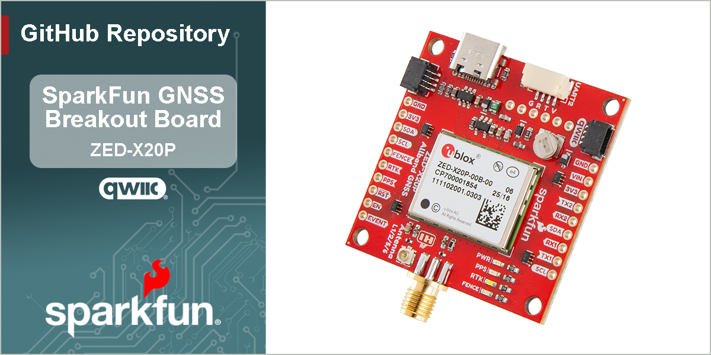

SparkFun Allband GNSS RTK Breakout - ZED-X20P (Qwiic)
========================================

[*SparkFun Allband GNSS RTK Breakout - ZED-X20P (Qwiic) (GPS-28871)*](https://www.sparkfun.com/sparkfun-allband-gnss-rtk-breakout-zed-x20p-qwiic.html)

The SparkFun All-band GNSS RTK Breakout - ZED-X20P (Qwiic) features the latest GNSS engine from u-blox; the X20, which is a successor to their popular F9 engine. This board's dimensions, pin layout, and connectors are very similar to the [SparkFun GPS-RTK-SMA Breakout - ZED-F9P (Qwiic)](https://www.sparkfun.com/sparkfun-gps-rtk-sma-breakout-zed-f9p-qwiic.html); and in most circumstances, can be used as a drop-in replacement. The board also accommodates users with a diverse choice of interfaces including USB, UART, SPI, and I2C.

The ZED-X20P module is an all-band, high precision GNSS receiver that concurrently processes signals from the GPS, Galileo, BeiDou, QZSS, and NavIC constellations across all GNSS frequency bands, including L-band. With positioning algorithms for Real-time Kinematics (RTK), PPP-RTK, and Precise Point Positioning* (PPP) technologies, the module supports standard RTCM corrections for Virtual Reference Stations (VRS) in a Network RTK setup or a local base station setup. Additionally, L-band correction services are natively supported without the need to integrate an external receiver, such as the NEO-D9S.

With its very high update rate, the ZED-X20P module is ideal for control applications, ensuring smooth and reliable operation. The module also protects system integrity with multi-layered defenses, including a Root of Trust, jamming and spoofing detection, cryptographic authentication of navigation messages through Galileo OSNMA, and more. This represents the highest level of integration in a single-chip receiver for the navigation and robotics markets; in unmanned autonomous vehicles (UAVs), guidance systems, and auto-steering applications.

The ZED-X20P module is supported by the u-blox u-center 2 GNSS software for real-time performance analysis, receiver configuration, and data logging. The AssistNow Online, Offline, and Autonomous A-GNSS services can also be used with the module for faster satellite acquisition. Users can also interface with the GNSS module using NMEA 4.11 and UBX binary protocols.

> [!NOTE]
> The USB interface does not fully comply with industry standards and is not suitable for production use. The USB 2.0 FS (full speed, 12 Mbit/s) interface can be used for host communication. Due to the hardware implementation, it may not be possible to certify the USB interface.
> 
> `*`: Feature in development

Documentation
-------------

- **[Hookup Guide (mkdocs)](http://docs.sparkfun.com/SparkFun_GNSS_ZED-X20P/)** - A hookup guide for the SparkFun Allband GNSS RTK Breakout - ZED-X20P breakout board hosted by GitHub pages. 
   
- [SparkFun u-blox GNSS v3 Arduino Library](https://github.com/sparkfun/SparkFun_u-blox_GNSS_v3) - An Arduino library for the u-blox GNSS modules

Repository Contents
-------------------

- **[/docs](/docs/)** - Online documentation files
  - [/assets](/docs/assets/) - Assets files
    - [/3d_model](/docs/assets/3d_model/) - 3D models for the board
    - [/board_files](/docs/assets/board_files/) - Design files for the board
      - [KiCad Design Files](/docs/assets/board_files/kicad_files.zip) (.zip)
      - [Schematic](/docs/assets/board_files/schematic.pdf) (.pdf)
      - [Dimensions](/docs/assets/board_files/dimensions.pdf) (.pdf)
    - [/component_documentation](/docs/assets/component_documentation/) - Datasheets for hardware components
    - [/img/hookup_guide](/docs/assets/img/hookup_guide/) - Images for hookup guide documentation - Hookup guide images for the board
    - /Hardware - Hardware design files (.brd, .sch)
      - /Production - Production files

Product Variants
----------------

- [GPS-28871](https://www.sparkfun.com/sparkfun-allband-gnss-rtk-breakout-zed-x20p-qwiic.html) - Breakout Board
- Flex Modules
  - [GPS-29362](https://www.sparkfun.com/sparkpnt-gnss-flex-module-zed-x20p.html) - SparkPNT GNSS Flex Module
  - [GPS-28997](https://www.sparkfun.com/sparkpnt-gnss-flex-module-zed-x20p-im19-imu.html) - SparkPNT GNSS Flex Module w/ IMU
- pHAT Kits:
  - [GPS-29887](https://www.sparkfun.com/sparkfun-gnss-flex-phat-zed-x20p.html) - SparkFun GNSS Flex pHAT
  - [GPS-29888](https://www.sparkfun.com/sparkfun-gnss-flex-phat-zed-x20p-im19-imu.html) - SparkFun GNSS Flex pHAT w/ IMU

Version History
---------------

- [v10](https://github.com/sparkfun/SparkFun_GNSS_ZED-X20P/releases/tag/v10) - Initial Release

License Information
-------------------

This product is ***open source***!

Please review the [`LICENSE.md`](./LICENSE.md) file for license information.

If you have any questions or concerns about licensing, please contact technical support on our [SparkFun forums](https://forum.sparkfun.com/viewforum.php?f=152).

Distributed as-is; no warranty is given.

- Your friends at SparkFun.
