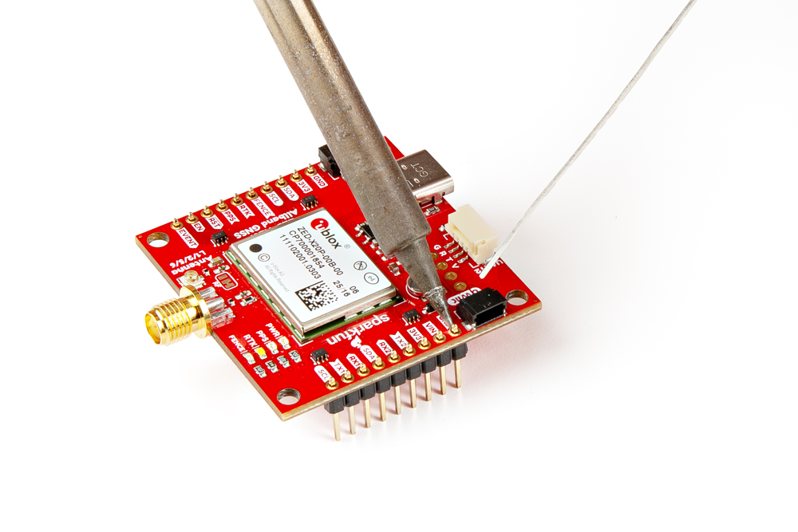

## USB Programming
The USB connection is utilized for configuration and communication with the ZED-X20P GNSS module. Users only need to connect their ZED-X20P GNSS breakout board to a computer using a USB-C cable.

<figure markdown>
[{ width="400" }](./assets/img/hookup_guide/assembly-usb.jpg "Click to enlarge")
<figcaption markdown>The ZED-X20P GNSS breakout board with a USB-C cable attached.</figcaption>
</figure>

## External Antenna
In order to receive [GNSS](https://en.wikipedia.org/wiki/Satellite_navigation "Global Navigation Satellite System") signals, users will need to connect a compatible antenna.

<figure markdown>
[{ width="400" }](./assets/img/hookup_guide/assembly-sma.jpg "Click to enlarge")
<figcaption markdown>Attaching a GNSS antenna to the SMA connector on the ZED-X20P GNSS breakout board.</figcaption>
</figure>

!!! tip
	For the best performance, we recommend users choose a compatible L1/L2/L5/L-band GNSS antenna and utilize a low-loss cable. Also, don't forget that GNSS signals are fairly weak and can't penetrate buildings or dense vegetation. The GNSS antenna should have an unobstructed view of the sky.

### U.FL Connector
Users have the option of utilizing the U.FL connector to attach an external GNSS antenna. An external antenna can be connected to the U.FL connector on the board with an [U.FL to SMA adapter cable](https://www.sparkfun.com/sma-to-u-fl-cable-150mm.html). In order to utilize the U.FL connector, the `RF` jumper must be modified to change the signal path.

??? note "Never modified a jumper before?"
	Check out our <a href="https://learn.sparkfun.com/tutorials/664">Jumper Pads and PCB Traces tutorial</a> for a quick introduction!

	<article class="grid cards" markdown align="center">

	-   <a href="https://learn.sparkfun.com/tutorials/664">
		<figure markdown>
		
		</figure>

		---

		**How to Work with Jumper Pads and PCB Traces**</a>

	</article>

<figure markdown>
[{ width="400" }](./assets/img/hookup_guide/assembly-ufl.jpg "Click to enlarge")
<figcaption markdown>Connecting an external antenna to U.FL connector on the ZED-X20P GNSS breakout board.</figcaption>
</figure>

<figure markdown>
[{ width="400" }](./assets/img/hookup_guide/assembly-ufl_jumper.jpg "Click to enlarge")
<figcaption markdown>Cutting and soldering the `RF` jumper on the ZED-X20P GNSS breakout board, to utilize the GNSS antenna attached to the U.FL connector.</figcaption>
</figure>

## Breakout Pins
The [PTH](https://en.wikipedia.org/wiki/Through-hole_technology "Plated Through Holes") pins on the ZED-X20P GNSS breakout board are broken out into 0.1"-spaced pins on the outer edges of the board.

??? note "New to soldering?"
	If you have never soldered before or need a quick refresher, check out our [How to Solder: Through-Hole Soldering](https://learn.sparkfun.com/tutorials/how-to-solder-through-hole-soldering) guide.

	

	-   <a href="https://learn.sparkfun.com/tutorials/5">
		<figure markdown>
		
		</figure>

		---

		**How to Solder: Through-Hole Soldering**</a>

	

**Headers**

---

When selecting headers, be sure you are aware of the functionality you require.

<figure markdown>
[{ width="400" }](./assets/img/hookup_guide/assembly-headers.jpg "Click to enlarge")
<figcaption markdown>Soldering headers to the ZED-X20P GNSS breakout board.</figcaption>
</figure>

**Hookup Wires**

---

For a more permanent connection, users can solder wires directly to the board.

<figure markdown>
[{ width="400" }](./assets/img/hookup_guide/assembly-wires.jpg "Click to enlarge")
<figcaption markdown>Soldering wires to the ZED-X20P GNSS breakout board.</figcaption>
</figure>

### BlueSMiRF Header Pins
One of the three sets of [PTH](https://en.wikipedia.org/wiki/Through-hole_technology "Plated Through Holes") pins on the ZED-X20P GNSS breakout board is labeled `BlueSMiRF`. This set of header pins breaks out the `UART2` interface of the ZED-X20P module, which can be connected to a microcontroller or RF transceiver; such as the [BlueSMiRF *v2*](https://www.sparkfun.com/sparkfun-bluesmirf-v2-headers.html), Bluetooth^&reg;^ serial link. The BlueSMiRF *v2* comes in two variations, with [PTH pins](https://www.sparkfun.com/sparkfun-bluesmirf-v2.html) or [male header pins](https://www.sparkfun.com/sparkfun-bluesmirf-v2-headers.html). Users can directly solder the PTH variant to the board with [male headers](https://www.sparkfun.com/break-away-headers-straight.html), for a more permanent installation; otherwise, for more flexibility, a [stackable header](https://www.sparkfun.com/arduino-stackable-header-6-pin.html) can be utilized.

<figure markdown>
[{ width="400" }](./assets/img/hookup_guide/assembly-bluesmirf.jpg "Click to enlarge")
<figcaption markdown>Connecting the BlueSMiRF serial link with a [stackable header](https://www.sparkfun.com/arduino-stackable-header-6-pin.html) to the ZED-X20P GNSS breakout board.</figcaption>
</figure>

<figure markdown>
[{ width="400" }](./assets/img/hookup_guide/assembly-bluesmirf2.jpg "Click to enlarge")
<figcaption markdown>Connecting the BlueSMiRF serial link in a more compact orientation.</figcaption>
</figure>

!!! info "Default Settings"
	- Baudrate: 38400bps
	- Data Bits: 8
	- Parity: No
	- Stop Bits: 1

When connecting the ZED-X20P GNSS breakout board to another device, users need to be aware of the pin connections and voltage ranges of the products. Below, is a table of the pin connections that users can reference.

<article style="text-align: center;" markdown>

<table border="1" markdown>
<tr markdown>
<th style="vertical-align:middle;">Pin Number</th>
<td align="center" markdown>
	**1** 
	*(Left Side)*
</td>
<td align="center" markdown>**2**</td>
<td align="center" markdown>**3**</td>
<td align="center" markdown>**4**</td>
<td align="center" markdown>**5**</td>
<td align="center" markdown>
	**6** 
	*(Right)*
</td>
</tr>
<tr markdown>
<th style="vertical-align:middle;">Label</th>
<td align="center" markdown>`NC`</td>
<td align="center" markdown>`TXD`</td>
<td align="center" markdown>`RXD`</td>
<td align="center" markdown>`3V3`</td>
<td align="center" markdown>`NC`</td>
<td align="center" markdown>`GND`</td>
</tr>
<tr markdown>
<th style="vertical-align:middle;">Function</th>
<td align="center" markdown></td>
<td align="center" markdown>UART - Transmit</td>
<td align="center" markdown>UART - Receive</td>
<td align="center" markdown>Output Voltage: **3.3V**</td>
<td align="center" markdown></td>
<td align="center" markdown>Ground</td>
</tr>
</table>

</article>

## JST Connector
The `BlueSMiRF` header pins and JST connector, both break out the `UART2` interface of the ZED-X20P module. The JST connector can be used to attach to the [SiK Telemetry Radio V3](https://www.sparkfun.com/sik-telemetry-radio-v3-915mhz-100mw.html) for RTK corrections.

<figure markdown>
[{ width="400" }](./assets/img/hookup_guide/assembly-jst.jpg "Click to enlarge")
<figcaption markdown>Connecting the SiK Telemetry Radio V3 to the ZED-X20P GNSS breakout board.</figcaption>
</figure>

<figure markdown>
[{ width="400" }](./assets/img/hookup_guide/assembly-rtk.jpg "Click to enlarge")
<figcaption markdown>Operating the ZED-X20P GNSS breakout board as an RTK base station, transmitting RTK corrections with the SiK Telemetry Radio V3.</figcaption>
</figure>

!!! info "Default Settings"
	- Baudrate: 38400bps
	- Data Bits: 8
	- Parity: No
	- Stop Bits: 1

When connecting the ZED-X20P GNSS breakout board to another device, users need to be aware of the pin connections and voltage ranges of the products. Below, is a table of the pin connections that users can reference.

<article style="text-align: center;" markdown>
<table border="1" markdown>
<tr markdown>
<th style="vertical-align:middle;">Pin Number</th>
<td align="center" markdown>
	**1** 
	*(Left Side)*
</td>
<td align="center" markdown>**2**</td>
<td align="center" markdown>**3**</td>
<td align="center" markdown>
	**4** 
	*(Right)*
</td>
</tr>
<tr markdown>
<th style="vertical-align:middle;">Label</th>
<td align="center" markdown>`3V3`</td>
<td align="center" markdown>`TXD`</td>
<td align="center" markdown>`RXD`</td>
<td align="center" markdown>`GND`</td>
</tr>
<tr markdown>
<th style="vertical-align:middle;">Function</th>
<td align="center" markdown>Output Voltage: **3.3V**</td>
<td align="center" markdown>UART - Transmit</td>
<td align="center" markdown>UART - Receive</td>
<td align="center" markdown>Ground</td>
</tr>
</table>

</article>

## Qwiic Devices
The Qwiic system allows users to effortlessly prototype with a Qwiic compatible I^2^C device without soldering. Users can attach ZED-X20P GNSS breakout board along with other Qwiic [sensors or boards](https://www.sparkfun.com/special-categories/qwiic.html?sf_qwiic_product_type=8273%2C8279%2C8285%2C8288%2C8291%2C8294) to any [Qwiic compatible microcontroller](https://www.sparkfun.com/development-boards/microcontrollers.html?sf_global_qwiic_connector=8262), with just a few [Qwiic cables](https://www.sparkfun.com/sparkfun-qwiic-cable-kit.html). (*\*The example below, is for demonstration purposes and is not pertinent to the board functionality or this tutorial.*)

<figure markdown>
[{ width="400" }](./assets/img/hookup_guide/assembly-qwiic.jpg "Click to enlarge")
<figcaption markdown>Several Qwiic devices and microcontroller connected to the ZED-X20P GNSS breakout board.</figcaption>
</figure>
