## :material-folder-cog: Design Files

<!-- Import the component -->

-   :kicad-primary:{ .enlarge-logo } Design Files

	---

	- :fontawesome-solid-file-pdf: [Schematic](./assets/board_files/schematic.pdf)
	- :material-folder-zip: [KiCad Files](./assets/board_files/kicad_files.zip)
	- :material-rotate-3d: [STEP File](./assets/3d_model/cad_model.step)
	- :fontawesome-solid-file-pdf: [Board Dimensions](./assets/board_files/dimensions.pdf):
		- 1.70" x 1.70" (43.2mm x 43.2mm)

-   <!-- Boxes in tabs -->

	=== "3D Model"
		<article style="text-align: center;" markdown>
		<model-viewer src="../assets/3d_model/web_model.glb" camera-controls poster="../assets/3d_model/poster.png" tone-mapping="neutral" shadow-intensity="2" shadow-softness="0.2" camera-orbit="0deg 75deg 0.103m" field-of-view="25.11deg" style="width: 100%; height: 450px;">
		</model-viewer>

		[Download the `*.step` File](./assets/3d_model/cad_model.step "Click download"){ .md-button .md-button--primary width="250px" }

		</article>

		???+ tip "Manipulate 3D Model"
			<article style="text-align: center;" markdown>

			| Controls       | Mouse                    | Touchscreen    |
			| :------------- | :----------------------: | :------------: |
			| Zoom           | Scroll Wheel             | 2-Finger Pinch |
			| Rotate         | ++"Left-Click"++ & Drag  | 1-Finger Drag  |
			| Move/Translate | ++"Right-Click"++ & Drag | 2-Finger Drag  |

			</article>

	=== "Dimensions"
		<article style="text-align: center;" markdown>
		[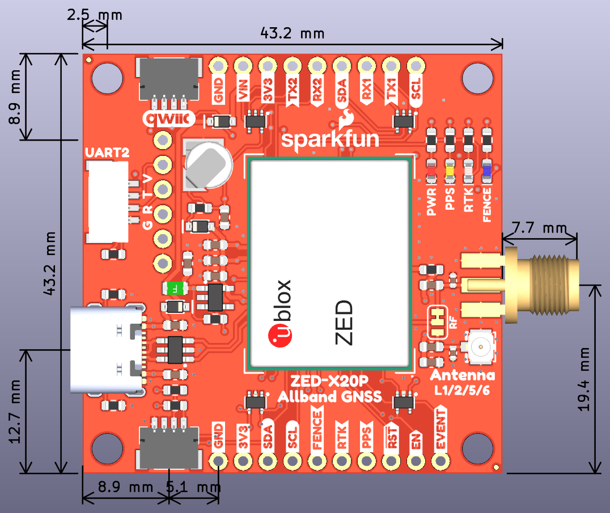{ width="450" }](./assets/board_files/dimensions.png "Click to enlarge")
		<figcaption markdown>Dimensions of the ZED-X20P GNSS breakout board.</figcaption>
		</article>

		???+ tip "Need more measurements?"
			For more information about the board's dimensions, users can download the [KiCad files](./assets/board_files/kicad_files.zip) for this board. These files can be opened in KiCad and additional measurements can be made with the measuring tool.

			!!! info ":octicons-download-16:{ .heart } KiCad - Free Download!"
				KiCad is free, open-source [CAD]("computer-aided design") program for electronics. Click on the button below to download their software. *(\*Users can find out more information about KiCad from their [website](https://www.kicad.org/).)*

				<article style="text-align: center;" markdown>
				[Download :kicad-primary:{ .enlarge-logo }](https://www.kicad.org/download/ "Go to downloads page"){ .md-button .md-button--primary width="250px" }
				</article>

			???+ info ":straight_ruler: Measuring Tool"
				This video demonstrates how to utilize the dimensions tool in KiCad, to include additional measurements:

				<article class="video-500px" style="text-align: center; margin: auto;" markdown>
				<iframe src="https://www.youtube.com/embed/-eXuD8pkCYw" title="KiCad Dimension Tool" frameborder="0" allow="accelerometer; autoplay; clipboard-write; encrypted-media; gyroscope; picture-in-picture" allowfullscreen></iframe>
				{ .qr width="85" }
				</article>

## Board Layout
The SparkFun Allband GNSS RTK Breakout - ZED-X20P (Qwiic) features the following:

<figure markdown>
[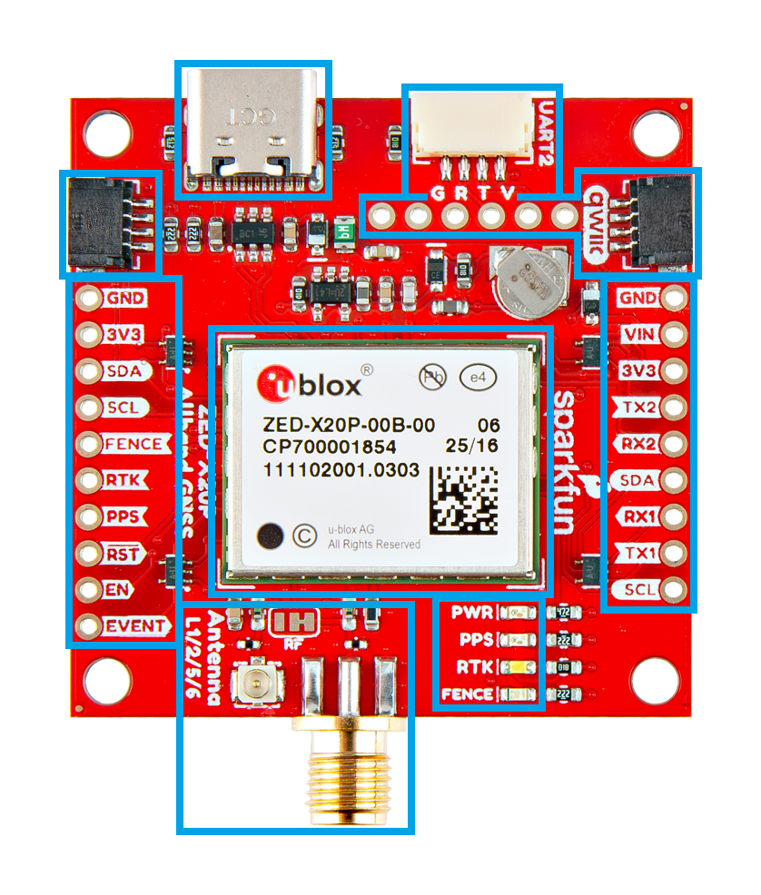{ width="500" }](./assets/img/hookup_guide/layout.png "Click to enlarge")
<figcaption markdown>Layout of the major components on the breakout board.</figcaption>
</figure>

1. **USB-C Connector**
:   The primary inteface for powering and interacting with the board
1. **ZED-X20P GNSS Module**
:   The u-blox ZED-X20P GNSS module
1. **Header Pins**
:   Exposes pins to power the board and breaks out the interfaces of the ZED-X20P GNSS module
1. **BlueSMiRF Header Pins**
:   Exposes the `UART2` interface of the ZED-X20P GNSS module
1. **JST Connector**
:   Exposes the `UART2` interface of the ZED-X20P GNSS module
1. **Qwiic Connectors**
:   Exposes the I^2^C interface of the ZED-X20P GNSS module
1. **Status LEDs**
:   LED status indicators for the ZED-X20P GNSS module
1. **`Antenna L1/2/5/6` RF Connectors**
:   SMA and U.FL *(optional)* connectors for an external GNSS antenna

## USB-C Connector
A USB connector is provided to power the board and interface with the ZED-X20P GNSS receiver. For most users, it will be the primary method for communicating with the ZED-X20P module.

<figure markdown>
[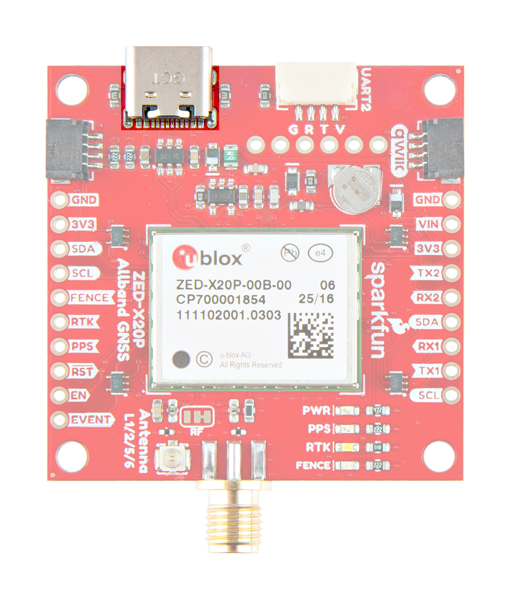{ width="400" }](./assets/img/hookup_guide/usb_connector.png "Click to enlarge")
<figcaption markdown>USB-C connector on the ZED-X20P GNSS breakout board.</figcaption>
</figure>

## Power
The simplest method to power the board is through the USB-C connector. However, the ZED-X20P GNSS breakout board only requires **3.3V** to power most of its components(1), which can be supplied though JST connector, Qwiic connector, or [PTH](https://en.wikipedia.org/wiki/Through-hole_technology "Plated Through Holes") pins.
{ .annotate }

1. 5V is only required to utilize the USB interface; and when enabled, it can also power the JST connector.

<figure markdown>
[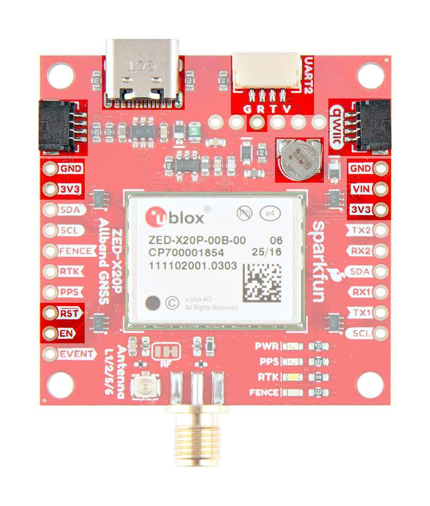{ width="400" }](./assets/img/hookup_guide/power_connections.png "Click to enlarge")
<figcaption markdown>ZED-X20P GNSS breakout board's power connections.</figcaption>
</figure>

Below, is a general summary of the power circuitry on the board; most are broken out as [PTH](https://en.wikipedia.org/wiki/Through-hole_technology "Plated Through Holes") pins:

- **`VIN`** - The voltage from the USB-C connector, usually **5V**.
	- Input Voltage Range: 1.2 - 5.5V (1)
	- Power source for the entire board
		- Powers the 3.3V voltage regulator (RT9080), which can source up to 600mA
		- When enabled, it can also power the [BlueSMiRF header](#bluesmirf-header)
- **`3V3`** - Provides a regulated 3.3V from the [RT9080](./assets/component_documentation/RT9080.pdf), using the power supplied from the `VIN` pin or USB-C connector.
	- Used to power the ZED-X20P module, LEDs, [Qwiic connectors](#qwiic), [BlueSMiRF header](#bluesmirf-header), and backup battery
	- Controlled by the `EN` pin, which is enabled by default
- **`EN`** - Enables the voltage output from the [RT9080](./assets/component_documentation/RT9080.pdf), 3.3V voltage regulator
	- Enabled by default *(active `HIGH`)*
- **`RST`** - Used to reset the ZED-X20P GNSS module
	- Connected to the [`RESET_N` pin](#pio-pins) of the ZED-X20P module, an input-only pin with an internal pull-up resistor (2)
	- Driving the pin `LOW` for at least 1ms triggers a cold-start reset, clearing the `BBR` content *(receiver configuration, real-time clock (RTC), and GNSS orbit data)*
- **`GND`** - The common ground or the 0V reference for the voltage supplies.
- **Backup Battery** - Provides backup power to the ZED-X20P GNSS module to maintain ephemeris data for warm starts

1. While the [RT9080](./assets/component_documentation/RT9080.pdf) LDO regulator has an input voltage range of 1.2 - 5.5V, a minimum supply voltage of **3.5V** is recommended for a 3.3V output.

1. No capacitors should be placed between `RESET_N` to GND, otherwise it could trigger a reset on every startup.

!!! tip "JST Connector"
	The `VSEL` pin of the [BlueSMiRF header](#bluesmirf-header) is designed to operate as a voltage output. However, an input voltage can be supplied through the pin, but users should be mindful of any voltage contention issues.

	Additionally, the jumper for the `VSEL` pin can be modified to change to output voltage level.

!!! info
	For more details, users can reference the [schematic](./assets/board_files/schematic.pdf) and the datasheets of the individual components on the board.

<!-- Not detailed in the datasheet or integration manual, information pulled from another u-blox GNSS module
### Power Modes
The ZED-X20P GNSS module supports three different operation modes:

- **Continuous Mode**

:   In this mode, the module uses dedicated signal processing engines optimized for signal acquisition and tracking.

	- The acquisition engine actively searches and acquires signals, during cold starts or when insufficient signals are available during navigation.
	- The tracking engine continuously tracks signals, downloads all the almanac data, and acquires new signals as they become available during navigation.
	
	The tracking engine consumes less power than the acquisition engine. Therefore, the module's current consumption is lower when a valid position is obtained quickly after startup, the entire almanac has been downloaded, and the ephemeris for available satellites are valid.

- **Backup Modes**

:   The ZED-X20P module supports two backup modes. The backup modes are inactive states with reduced power consumption, where the receiver maintains time, information, and navigation data to speed up signal acquisitions upon restart.

	- **Hardware backup mode**

	:   The hardware backup mode requires `V_BCKP` power to be supplied. It allows the module to enter a backup state and maintain the backup domain (`BBR` and `RTC`), after the main power has been switched off.

	- **Software standby mode**

	:   Software standby mode is entered using the `UBX-RXM-PMREQ` message. This mode will clear the RAM memory; to maintain the receiver configuration, it should be stored on `BBR` or flash layers. The software standby mode can be set for a specific duration, or until the receiver is woken up by a signal from the UART `RX` and/or `EXTINT` pins, as defined in `UBX-RXM-PMREQ` message. A system reset with the `RESET_N` signal also terminates the software standby mode, clears the `BBR` content and restarts the receiver.

- **Safe Boot Mode**
-->

### Power Consumption
The power consumption of the ZED-X20P module depends on the GNSS signals enabled and if the module is acquiring or tacking those signals. The table below, lists the average current consumption with a supply voltage of 3.3V.

<article style="text-align: center;" markdown>

| GNSS Signals | Acquisition | Tracking |
| :----------- | :---------: | :------: |
| GPS+GAL+BDS  | 75mA        | 70mA     |
| GPS          | 50mA        | 50mA     |

</article>

!!! tip
	During acquisition, the current consumption may reach up to 85mA; make sure the primary power source can sustain this.

<!--
!!! info "Backup Modes"
	The current consumption for the backup modes:

	- Hardware backup Mode: 31µA
	- Software standby Mode: 49µA
-->

!!! info
	For more information, please refer to the [ZED-X20P Datasheet](./assets/component_documentation/ZED-X20P_DataSheet_UBXDOC-963802114-13074.pdf).

## ZED-X20P GNSS Receiver
The centerpiece of this GNSS breakout board is the [ZED-X20P module](./assets/component_documentation/ZED-X20P_DataSheet_UBXDOC-963802114-13074.pdf) from [u-blox](https://www.u-blox.com/en); it features their latest X20 GNSS engine, a successor to their popular F9 engine. The ZED-X20P module is an all-band, high precision GNSS receiver that concurrently processes signals from the GPS, Galileo, BeiDou, QZSS, and NavIC constellations across all GNSS frequency bands, including L-band. With positioning algorithms for Real-time Kinematics (RTK), PPP-RTK, and Precise Point Positioning* (PPP) technologies, the module supports standard RTCM corrections for Virtual Reference Stations (VRS) in a Network RTK setup or a local base station setup. Additionally, L-band correction services are natively supported without the need to integrate an external receiver, such as the NEO-D9S.

With its very high update rate, the ZED-X20P module is ideal for control applications, ensuring smooth and reliable operation. The module also protects system integrity with multi-layered defenses, including a Root of Trust, jamming and spoofing detection, cryptographic authentication of navigation messages through Galileo OSNMA, and more. The module also accommodates users with a diverse choice of interfaces including USB, UART, SPI, and I^2^C.

!!! note
	`*`: Feature in development

<figure markdown>
[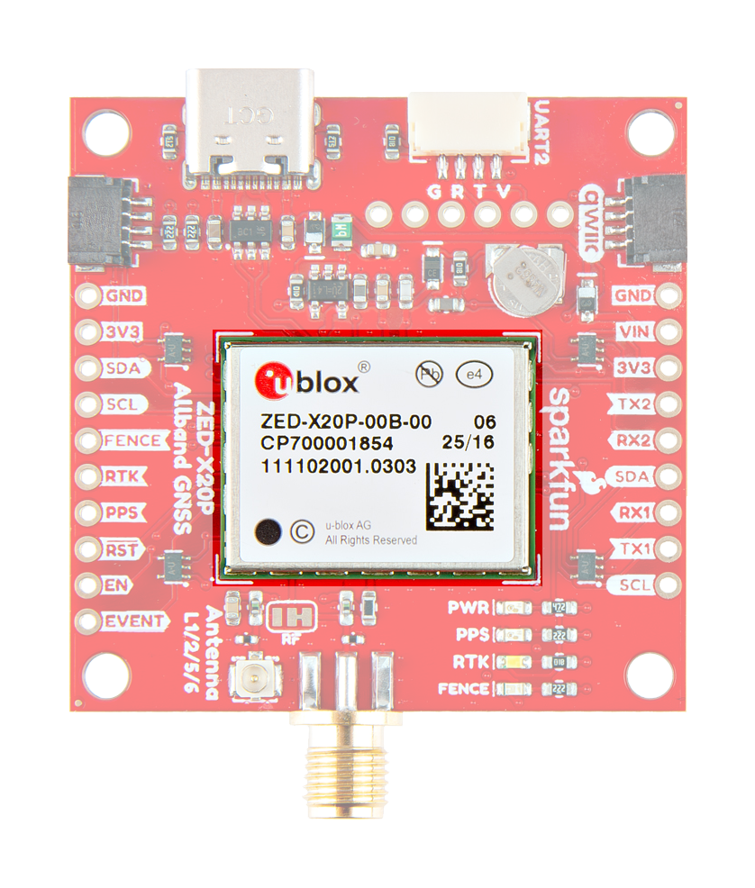{ width="400" }](./assets/img/hookup_guide/ZED-X20P.png "Click to enlarge")
<figcaption markdown>The ZED-X20P module on the breakout board.</figcaption>
</figure>

<article class="video-500px" style="margin: auto;" markdown>
<iframe src="https://www.youtube.com/embed/dRFR38xS2b4" title="u-blox launches the ZED-X20P. Our first all-band, global GNSS module." frameborder="0" allow="accelerometer; autoplay; clipboard-write; encrypted-media; gyroscope; picture-in-picture" allowfullscreen></iframe>
{ .qr }
</article>

<figure markdown>
[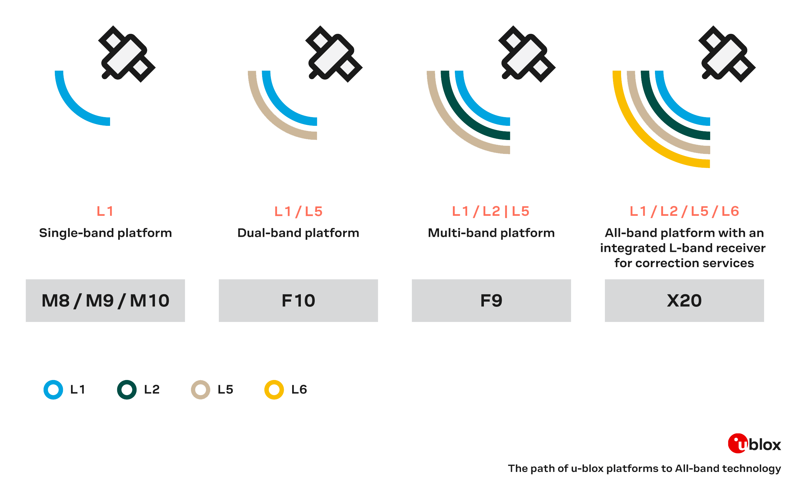{ width="500" }](https://content.u-blox.com/sites/default/files/2024-09/X20-u-blox-the-path-of-u-blox-platforms-to-all-band-technologyx20-u-blox-the-path-of-u-blox-platforms-to-all-band-technology-visual.png "Click to enlarge")
<figcaption markdown>The frequency bands supported by the various u-blox GNSS engines.</figcaption>
</figure>

**Features:**

- Supply voltage: 2.7V to 3.6V
- GNSS Constellations:
	- GPS (USA)
	- Galileo (EU)
	- BDS (China)
	- QZSS (Japan)
	- NavIC (India)
- SBAS Systems:
	- WASS (USA)
	- EGNOS (EU)
	- BDSBAS (China)
	- MSAS (Japan)
	- GAGAN (India)
- Sensitivity
	- Tracking and Nav.: -167dBm
	- Reacquisition: -160dBm
	- Cold start: -148dBm
	- Hot start: -157dBm
- Accuracy
	- Dynamic
		- Velocity: 0.05m/s
		- Heading: 0.3&deg;
	- Static/Position *(GPS+GAL+BDS)*
		- Horizontal position accuracy (CEP)
			- PVT: 1.2m
			- SBAS: 0.6m
			- RTK: 0.01m + 1ppm
			- SPARTN: <0.06m
		- Vertical position accuracy (Median)
			- PVT: 2.0m
			- SBAS: 1.0m
			- RTK: 0.01m + 1ppm
			- SPARTN: <0.10 m

 

- Operational limits
	- Dynamics: <4g
	- Altitude: 80,000m
	- Velocity: 500m/s
	- Update Rate: Up to 25Hz
- Time to Fix
	- Cold Start: < 27s
	- Aided Start: < 2s
	- Hot Start: 2s
- Convergence time:
	- RTK: < 10s
	- SPARTN: < 50s
- Features
    - Programmable flash memory
    - Carrier phase output
    - Jamming detection
    - Galileo OSNMA
    - Secure boot
- Interfaces:
    - USB
    - UART x2
    - SPI
    - I^2^C
	- Digital I/O
		- `TIMEPULSE` configurable: 0.25 - 10MHz
		- `EXTINT` input for Wakeup
- Services:
    - AssistNow
    - PointPerfect
- Operating temperature: -40°C to 85°C
- Dimensions: 17.0mm x 22.0mm x 2.4mm

### Frequency Bands
The ZED-X20P module is an all-band, high precision GNSS receiver that concurrently processes signals from the GPS, Galileo, BeiDou, QZSS, and NavIC constellations across all GNSS frequency bands, including L-band. Below, are the frequency bands provided by all the global navigation satellite systems and the ones supported by the ZED-X20P module.

<figure markdown>
[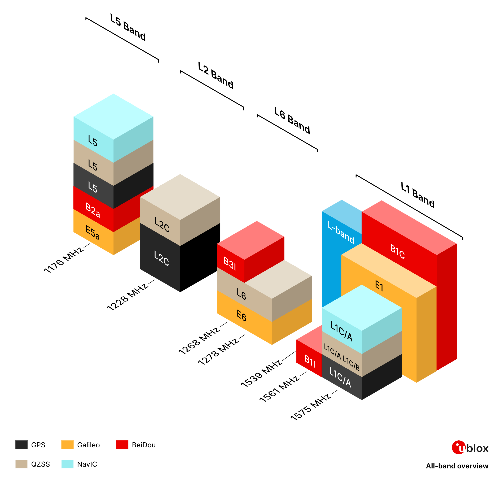{ width="400" }](https://content.u-blox.com/sites/default/files/2025-03/all-band-overview-design.png "Click to enlarge")
<figcaption markdown>The frequency bands supported by the ZED-X20P GNSS receiver.</figcaption>
</figure>

<article style="text-align: center;" markdown>

| Constellation | Frequency Bands            |
| :-----------: | :------------------------- |
| GPS           | L1C/A, L2C, L5             |
| QZSS          | L1C/A, L1C/B*, L2C, L5, L6 |
| GAL           | E1B/C, E5a, E6             |
| BDS           | B1I, B1C, B2a, B3I         |
| NavIC         | L1*, L5                    |
| SBAS          | L1C/A                      |

*The supported frequency bands, organized by constellation.*
</article>

!!! note
	`*`: Feature in development

<figure markdown>
[{ width="800" style="background-color: rgba(255, 255, 255, 0.85); padding: 5px;" }](https://www.tallysman.com/app/uploads/2021/07/Tallysman-GNSS-Frequencies-v8.0_Chart-1-1024x425.png "Click to enlarge")
<figcaption markdown>Frequency bands of the global navigation satellite systems. (Source: [Tallysman](https://www.tallysman.com/gnss-constellations-radio-frequencies-and-signals/))</figcaption>
</figure>

!!! note "Configuration Settings"
	Each GNSS constellations and their signal bands can be enabled or disabled independently, using keys from the `CFG-SIGNAL-*` configuration group; except for the QZSS and SBAS constellation. A GNSS constellation is considered to be enabled when the constellation enable key is set and at least one of the constellation's band keys is enabled. However, the ZED-X20P only supports certain combinations of constellations and bands. For all GNSS constellations, the `L1` band is mandatory even in combination with another frequency band. Any unsupported combinations will be rejected with a `UBX-ACK-NAK` and the warning: `inv sig cfg` will be sent via UBX-INF and NMEA-TXT messages *(if enabled)*.

	??? info "Supported Combinations"

		<article style="text-align: center;" markdown>

		| Constellation key `CFG-SIGNAL-GAL_ENA` | Band key `CFG-SIGNAL-GAL_E1_ENA` | Band key `CFG-SIGNAL-GAL_E5A_ENA` | Band key `CFG-SIGNAL-GAL_E6_ENA` | Constellation enabled? |
		| :---------- | :---------- | :---------- | :---------- | :-: |
		| true (`1`)  | true (`1`)  | true (`1`)  | true (`1`)  | yes |
		| true (`1`)  | true (`1`)  | true (`1`)  | false (`0`) | yes |
		| true (`1`)  | true (`1`)  | false (`0`) | true (`1`)  | yes |
		| true (`1`)  | true (`1`)  | false (`0`) | false (`0`) | yes |
		| true (`1`)  | false (`0`) | true (`1`)  | true (`1`)  | no  |
		| true (`1`)  | false (`0`) | false (`0`) | true (`1`)  | no  |
		| true (`1`)  | false (`0`) | true (`1`)  | false (`0`) | no  |
		| true (`1`)  | false (`0`) | false (`0`) | false (`0`) | no  |
		| false (`0`) | true (`1`)  | true (`1`)  | true (`1`)  | no  |
		| false (`0`) | true (`1`)  | true (`1`)  | false (`0`) | no  |
		| false (`0`) | true (`1`)  | false (`0`) | true (`1`)  | no  |
		| false (`0`) | false (`0`) | true (`1`)  | true (`1`)  | no  |
		| false (`0`) | false (`0`) | false (`0`) | true (`1`)  | no  |
		| false (`0`) | false (`0`) | true (`1`)  | false (`0`) | no  |
		| false (`0`) | true (`1`)  | false (`0`) | false (`0`) | no  |
		| false (`0`) | false (`0`) | false (`0`) | false (`0`) | no  |

		</article>

??? info "What are Frequency Bands?"
	A [frequency band](https://en.wikipedia.org/wiki/Frequency_band) is a section of the [electromagnetic spectrum](https://en.wikipedia.org/wiki/Electromagnetic_spectrum), usually denoted by the range of its upper and lower limits. In the [radio spectrum](https://en.wikipedia.org/wiki/Radio_spectrum), these frequency bands are usually regulated by region, often through a government entity. This regulation prevents the interference of RF communication; and often includes major penalties for any interference with critical infrastructure systems and emergency services.

	<figure markdown>
	[{ width="400" }](https://gssc.esa.int/navipedia/images/c/cf/GNSS_All_Signals.png "Click to enlarge")
	<figcaption markdown>Frequency bands of the global navigation satellite systems. (Source: [ESA](https://gssc.esa.int/navipedia/index.php?title=File:GNSS_All_Signals.png "European Space Agency"))</figcaption>
	</figure>

	However, if the various GNSS constellations share similar frequency bands, then how do they avoid interfering with one another? Without going too far into detail, the image above illustrates the frequency bands of each system with a few characteristics specific to their signals. Wit these characteristics in mind, along with other factors, the chart can help users to visualize how multiple GNSS constellations might co-exist with each other.

	For more information, users may find these articles of interest:

	- [GNSS signal](https://gssc.esa.int/navipedia/index.php/GNSS_signal)
	- [GPS Signal Plan](https://gssc.esa.int/navipedia/index.php?title=GPS_Signal_Plan)
	- [GLONASS Signal Plan](https://gssc.esa.int/navipedia/index.php?title=GLONASS_Signal_Plan)
	- [GALILEO Signal Plan](https://gssc.esa.int/navipedia/index.php?title=GALILEO_Signal_Plan)

## Peripherals and I/O Pins
The ZED-X20P module has twenty-one I/O pins, of which eight are programmable. Most of these are broken out as [PTH](https://en.wikipedia.org/wiki/Through-hole_technology "Plated Through Holes") pins on the ZED-X20P GNSS breakout board; whereas, others are broken out to their specific interface *(i.e. USB connector, jumper, U.FL connector, etc.)*. Additionally, some of the I/O connections are broken out with multiple components or interfaces.

<figure markdown>
[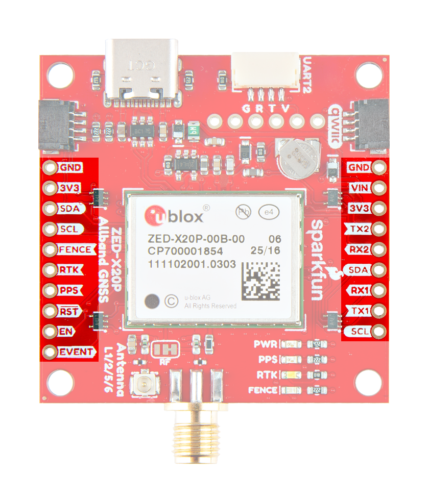{ width="400" }](./assets/img/hookup_guide/headers.png "Click to enlarge")
<figcaption markdown>The header pins on the ZED-X20P GNSS breakout board.</figcaption>
</figure>

<article class="annotate" markdown>
**Interfaces:**

- USB
- UART x2
- SPI
- I^2^C
	- Address *(7-bit)*: **0x42** *(`1000010`)*
- ~~1x Antenna Detect~~ (1)
- ~~1x Antenna Short~~ (2)
- ~~1x Antenna Off~~ (3)
- 1x External interrupt
- 1x PPS output signal
- 1x TX Ready
- 1x RTK Stat
- 1x Geo Stat
- 1x D_Sel pin
- 1x Safe boot pin
- 1x Reset pin

</article>

1. Not available on the ZED-X20P GNSS breakout board.
1. Not available on the ZED-X20P GNSS breakout board.
1. Not available on the ZED-X20P GNSS breakout board.

<!--
!!! info "Pin States"
	This table defines the state of the PIO and `RESET_N` pins in different operational modes. The functions of the PIOs are as defined in the default configuration.

	<article style="text-align: center;" markdown>

	| Pin no. | Default function | Continuous mode | Software standby mode | Safe boot mode |
	| :-----: | :--------------- | :-------------: | :-------------------: | :------------: |
	| 47 | `D_SEL`=open `D_SEL`=`GND` | Input pull-up High-Z | Input pull-up Input pull-down | Input pull-up High-Z |
	| 43 | `RXD` `SPI_SDO` | Input pull-up High-Z | Input pull-up | Input pull-up |
	| 42 | `TXD` `SPI_SDI` | Output | Input pull-up | Output |
	| 44 | `SDA` `SPI_CS_N` | Input pull-up / Output High-Z | Input pull-up High-Z | Input pull-up / Output High-Z |
	| 45 | `SCL` `SPI_SLK` | Input pull-up High-Z | Input pull-up High-Z | Input pull-up High-Z |
	| 53 | `TIMEPULSE` | Output | Input pull-up | Output low |
	| 50 | `SAFEBOOT_N` | Input pull-up | Input pull-up | Input pull-up |
	| 51 | `EXTINT` | Input pull-up | Input pull-up | Input pull-up |
	| 26 | `RXD2` | Input pull-up | Input pull-up | Input pull-up |
	| 27 | `TXD2` | Output | Input pull-up | Output |
	| 49 | `RESET_N` | Input pull-up | Input pull-up | Input pull-up |

	</article>

	!!! note
		In reset mode (`RESET_N` = `LOW`), all PIOs are configured as input pull-up.

		In hardware backup mode (VCC = 0V), PIOs must not be driven.
-->

=== "UART Interface"
	The ZED-X20P has two UART interfaces that can be accessed either through the [PTH](https://en.wikipedia.org/wiki/Through-hole_technology "Plated Through Holes") pins. The `UART2` interface can also be accessed through the [BlueSMiRF header](#bluesmirf-header) and the [JST connector](#jst-connector).

	

	

	<figure markdown>
	[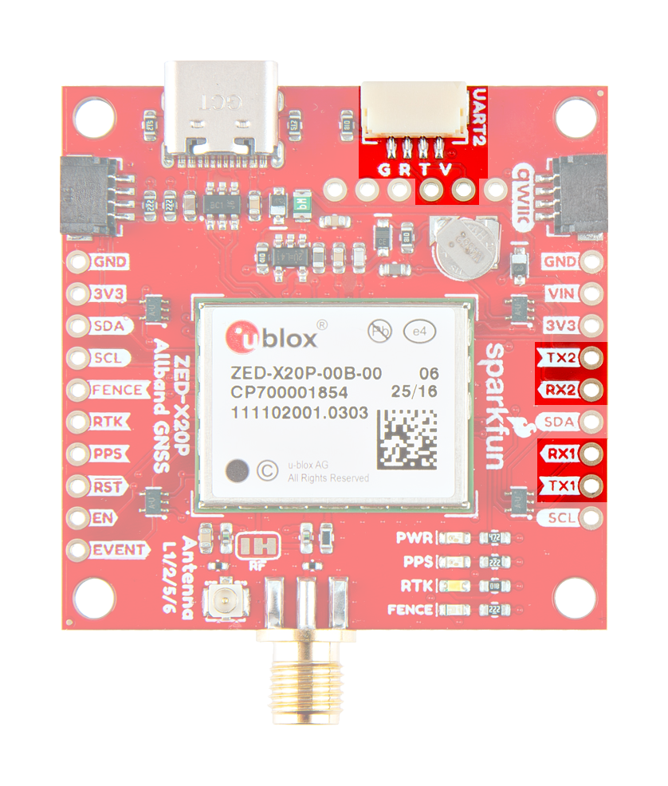{ width="400" }](./assets/img/hookup_guide/uart.png "Click to enlarge")
	<figcaption markdown>The UART interfaces on the ZED-X20P GNSS breakout board.</figcaption>
	</figure>

	!!! warning
		Firmware updates can only be performed with the `UART1` interface.

	!!! tip
		The UART `RX` interface will be disabled when more than 100 frame errors are detected during a one-second period. This can happen if the wrong baud rate is used or the UART `RX` pin is grounded. An error message appears when the UART `RX` interface is reenabled at the end of the one-second period.

	

	

	!!! info "Supported Protocols"
		The UART interface supports the following protocols:

		- Input messages: NMEA (GGA, GLL, GSA, GSV, RMC, VTG, and TXT), RTCM, SPARTN, and UBX
		- Output messages: NMEA, RTCM, and UBX

	!!! info "Configuration Settings"
		The UART interfaces can be configured with the `CFG-UART*` messages, but will initially have the following settings: 

		

		

		- Baudrate: 4800 to 8000000bps *(Default: 38400bps)*
		- Data Bits: 8
		- Parity: No
		- Stop Bits: 1
		- Flow Control: None

		

		

		- `UART1` Output
			- NMEA protocol with GGA, GLL, GSA, GSV, RMC, VTG, TXT messages are output by default.
			- UBX and RTCM 3.4 protocols are enabled by default, but no output messages are enabled by default.
		- `UART1` Input
			- UBX, NMEA and RTCM 3.4 input protocols are enabled by default.
		- `UART2` Output
			- RTCM 3.4 protocol is enabled by default, but no output messages are enabled by default.
			- NMEA protocol is disabled by default.
		- `UART2` Input
			- NMEA, RTCM 3.4, and SPARTN protocols are enabled by default.

		

		

	

	

=== "I^2^C"
	The ZED-X20P has a single I^2^C interface that can be accessed either through the [PTH](https://en.wikipedia.org/wiki/Through-hole_technology "Plated Through Holes") pins or the [Qwiic connector](#qwiic).

	<figure markdown>
	[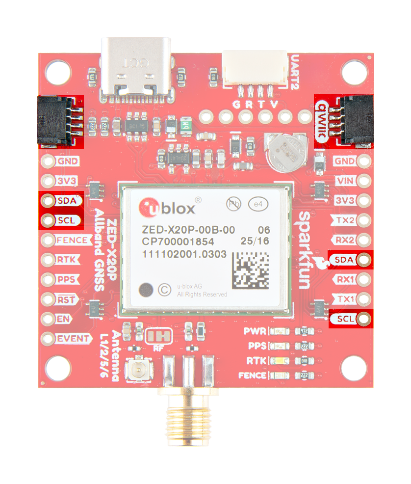{ width="400" }](./assets/img/hookup_guide/i2c.png "Click to enlarge")
	<figcaption markdown>The I^2^C connections on the ZED-X20P GNSS breakout board.</figcaption>
	</figure>

	!!! info
		For users interested in the specific details about the read and write access for th I^2^C bus, please refer to the [ZED-X20P integration manual](https://content.u-blox.com/sites/default/files/documents/DAN-F10N_IntegrationManual_UBXDOC-963802114-13252.pdf)

	??? tip "What is Qwiic?"

		<!-- Qwiic Banner -->
		

		[{ width=400 }](https://www.sparkfun.com/qwiic)
		[{ width=400 }](https://www.sparkfun.com/qwiic)
		

		---

		The [Qwiic connect system](https://www.sparkfun.com/qwiic) is a solderless, polarized connection system that allows users to seamlessly daisy chain I2C boards together. Play the video below to learn more about the Qwiic connect system or click on the banner above to learn more about [Qwiic products](https://www.sparkfun.com/qwiic).

		

		

		<iframe src="https://www.youtube.com/embed/x0RDEHqFIF8" title="SparkFun's Qwiic Connect System" frameborder="0" allow="accelerometer; encrypted-media; gyroscope; picture-in-picture" allowfullscreen></iframe>
		

		

		!!! info "Features of the Qwiic System"

			=== "No Soldering"

				{ align="left" width="90" }
				{ align="left" width="90" }

				Qwiic cables (4-pin JST) plug easily from development boards to sensors, shields, accessory boards and more, making easy work of setting up a new prototype.

			=== "Polarized Connector"

				{ align="left" width="90" }
				{ align="left" width="90" }

				There's no need to worry about accidentally swapping the SDA and SCL wires on your breadboard. The Qwiic connector is polarized so you know you’ll have it wired correctly every time, right from the start.

				The PCB connector is part number SM04B-SRSS ([Datasheet](https://cdn.sparkfun.com/assets/parts/1/2/2/8/9/Qwiic_Connector_Datasheet.pdf)) or equivalent. The mating connector used on cables is part number SHR04V-S-B or an equivalent *(1mm pitch, 4-pin JST connector)*.

			=== "Daisy Chain-able"

				{ align="left" width="90" }
				{ align="left" width="90" }

				It’s time to leverage the power of the I2C bus! Most Qwiic boards will have two or more connectors on them, allowing multiple devices to be connected.

=== "SPI"

	

	

	<figure markdown>
	[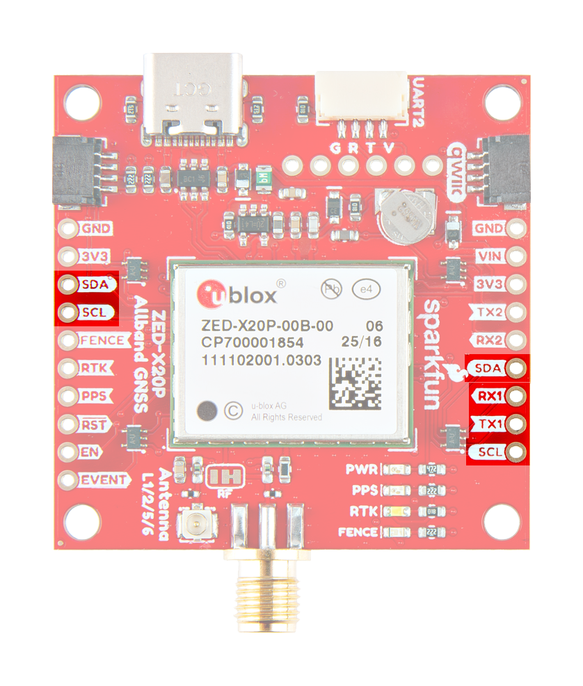{ width="400" }](./assets/img/hookup_guide/pins-spi.png "Click to enlarge")
	<figcaption markdown>The SPI pins on the ZED-X20P GNSS breakout board.</figcaption>
	</figure>

	

	

	The ZED-X20P has a single SPI interface that can be accessed through the [PTH](https://en.wikipedia.org/wiki/Through-hole_technology "Plated Through Holes") pins. To enable the SPI interface, users must modify the [`SPI` jumper](#jumpers).

	<article style="text-align: center;" markdown>

	| Labels | SPI Pins |
	| :-: | :-: |
	| TX1 | SDO |
	| RX1 | SDI |
	| SDA | CS  |
	| SCL | CLK |

	</article>

	

	

=== "PIO Pins"
	The ZED-X20P module features five programmable I/O pins, but the LNA enable pin is not broken out on this board. All the inputs have internal pull-up resistors in normal operation and can be left open if unused.

	

	

	**LED Indicators**

	---

	The `PPS`, `RTK`, and `FENCE` programmable I/O pins are also used as LED indicators.

	<figure markdown>
	[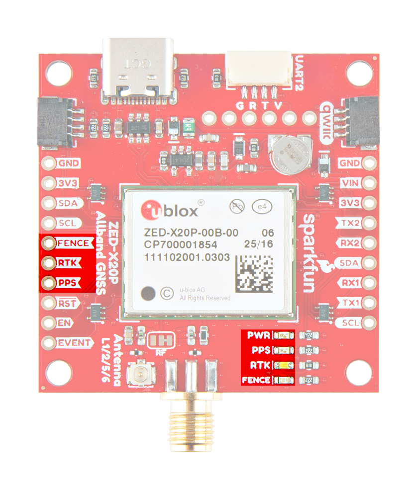{ width="400" }](./assets/img/hookup_guide/pins-LEDs.png "Click to enlarge")
	<figcaption markdown>The signal pins for the LED indicators on the ZED-X20P GNSS breakout board.</figcaption>
	</figure>

	!!! tip "Disable LEDs"
		There are [jumper](#jumpers) attached to the LEDs of the `PPS`, `RTK`, and `FENCE` pins. For low power applications, users can cut the jumper to disable the LED.

	

	

	- **`FENCE`**
	:   The `GEOFENCE_STAT` signal indicates the current geofence status as to whether the receiver is inside any of the active areas. It is possible to configure up to four circular areas as geofence locations. Once configured, the receiver continuously compares its current position with the preset geofenced areas.

			The receiver toggles the assigned pin according to the combined geofence state.

			- **Inside** - The position is inside the geofence with the configured confidence level
			- **Outside** - The position lies outside of the geofence with the configured confidence level
			- **Unknown** - There is no valid position solution or the position uncertainty does not allow for unambiguous state evaluation

			!!! info "Pin State"
				- **`HIGH`** - The `GEOFENCE_STAT` pin is always set to high level when the combined geofence state is unknown
				- **`Low`** - A low level can represent either an inside or outside state based upon the `CFG-GEOFENCE-PINPOL` configuration

	- **`RTK`**
	:   The `RTK_STAT` signal indicates the RTK positioning status and if a stream of valid correction messages is being received.

			!!! info "Pin State"
				- **`LOW`** - Indicates that RTK fixed mode has been achieved
				- *Blinking* - Indicates that a valid stream of correction messages is being received and utilized, but no RTK fixed mode has been achieved
				- **`HIGH`** - Indicates that no carrier phase solution is available

	- **`PPS`**
	:   The [`PPS`](https://en.wikipedia.org/wiki/Pulse-per-second_signal "Pulse Per Second") pin is connected to the module's time pulse (`TIMEPULSE`) signal and the [`PPS` LED](#status-leds), as a visual indicator. The period, length, and polarity (rising or falling edge) of the `TIMEPULSE` signal can be configured with the `CFG-TP-*` messages.

	

	

	<figure markdown>
	[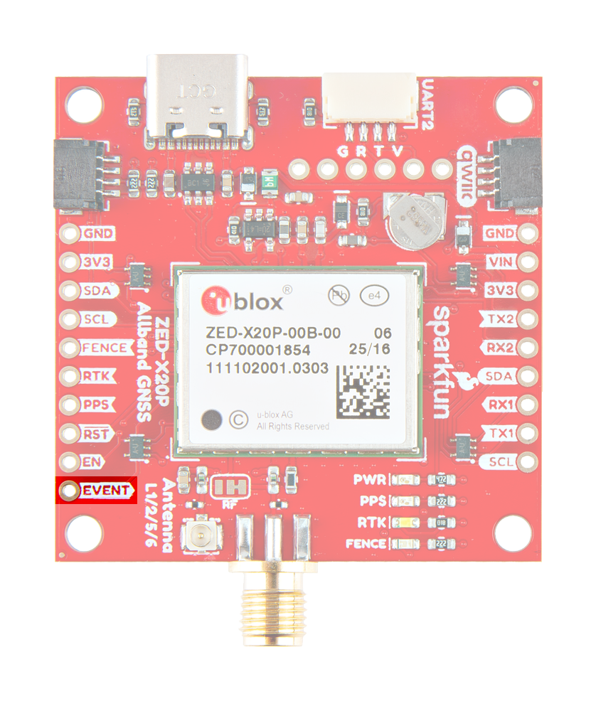{ width="250" }](./assets/img/hookup_guide/pins-event.png "Click to enlarge")
	<figcaption markdown>The `EVENT` pin on the ZED-X20P GNSS breakout board.</figcaption>
	</figure>

	- **`EVENT`**
	:   ZED-X20P supports external interrupts through its `EXTINT` pin. This is useful for waking the module up from its standby mode or for timing applications.

	<figure markdown>
	[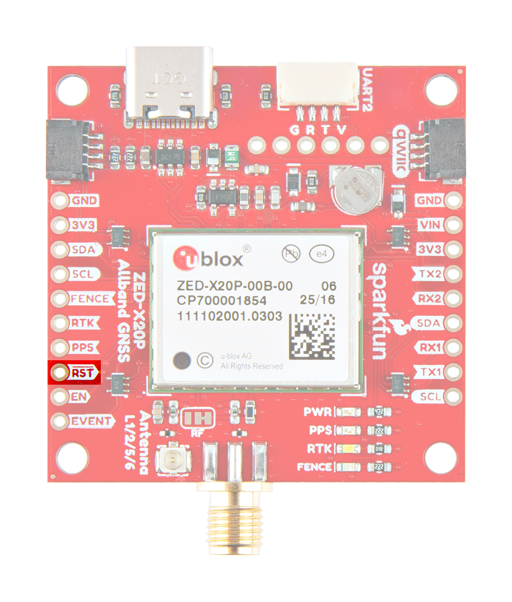{ width="250" }](./assets/img/hookup_guide/pins-reset.png "Click to enlarge")
	<figcaption markdown>The `RST` pin on the ZED-X20P GNSS breakout board.</figcaption>
	</figure>

	- **`RST`**
	:	The `RST`pin is connected to the `RESET_N` pin of the ZED-X20P module. Driving the pin `LOW` for at least 1ms triggers a cold-start reset, clearing the `BBR` content *(receiver configuration, real-time clock (RTC), and GNSS orbit data)*.

			!!! info
				Capacitors should not be placed between `RST` and `GND`; otherwise, it could trigger a reset on startup.

	- **`D_SEL`**
	:   The `D_SEL` pin can be used to configure the functionality of the combined `UART1`, I^2^C, and SPI interfaces. It is available as the [`SPI` jumper](#jumpers) on the back of the board.

			!!! info
				When pulled `LOW` (by closing the jumper), the `D_SEL` enables the SPI interface on the `UART1` and I^2^C pins.

	!!! note
		The `SAFEBOOT_N` test point is for updates and reconfiguration. The ZED-X20P module will enter safeboot mode, if this pin is pulled `LOW` at starup.

		The `SAFEBOOT_N` and `TIMEPULSE` (`PPS`) pins are internally connected in the ZED-X20P module, by a 1 k&ohm; series resistor. Make sure these pins have no load that could pull them low at startup; otherwise, the receiver will enter its safeboot mode.

### BlueSMiRF Header
The [`UART2` interface](#uart-interface) of the ZED-X20P can be accessed either through the BlueSMiRF header pins or the JST connector. The BlueSMiRF header can be used to connect the ZED-X20P GNSS module to external devices, such as a microcontroller or [BlueSMiRF v2](https://www.sparkfun.com/sparkfun-bluesmirf-v2.html), Bluetooth^&reg;^ serial link.

<figure markdown>
[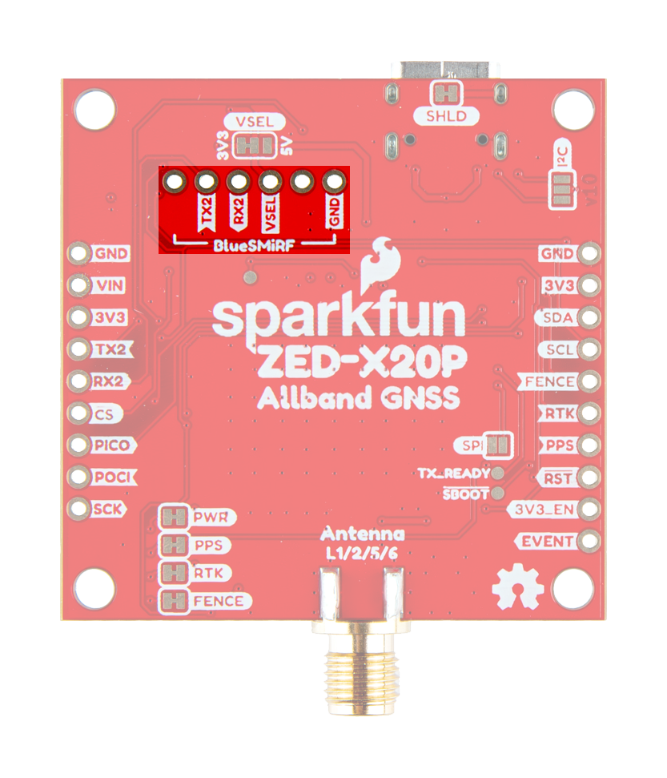{ width="400" }](./assets/img/hookup_guide/headers-bluesmirf.png "Click to enlarge")
<figcaption markdown>The BlueSMiRF header pins on the ZED-X20P GNSS breakout board.</figcaption>
</figure>

!!! info "Supported Protocols"
	The UART interface supports the following protocols:

	- Input messages: NMEA and UBX
	- Output messages: NMEA (GGA, GLL, GSA, GSV, RMC, VTG, and TXT)

!!! info "Configuration Settings"
	The UART interface can be configured with the `CFG-UART2-*` messages, but will initially have the following settings:

	- Baudrate: 9600 to 921600bps *(Default: 38400bps)*
	- Data Bits: 8
	- Parity: No
	- Stop Bits: 1
	- Flow Control: None

!!! warning "Bus Contention"
	To avoid [bus contention](https://en.wikipedia.org/wiki/Bus_contention) issues between the BlueSMiRF header pins or the JST connector; make sure only one devices is connected to either of these connection options.

!!! tip "Pin Connections"
	When connecting the ZED-X20P GNSS breakout board to another device, users need to be aware of the pin connections and voltage ranges of the products. Below, is a table of the pin connections for the BlueSMiRF header pins on the ZED-X20P GNSS breakout board.

	<article style="text-align: center;" markdown>

	<table border="1" markdown>
	<tr markdown>
	<th style="vertical-align:middle;">Pin Number</th>
	<td align="center" markdown>
		**1** 
		*(Left Side)*
	</td>
	<td align="center" markdown>**2**</td>
	<td align="center" markdown>**3**</td>
	<td align="center" markdown>**4**</td>
	<td align="center" markdown>**5**</td>
	<td align="center" markdown>
		**6** 
		*(Right)*
	</td>
	</tr>
	<tr markdown>
	<th style="vertical-align:middle;">Label</th>
	<td align="center" markdown>`NC`</td>
	<td align="center" markdown>`TXD`</td>
	<td align="center" markdown>`RXD`</td>
	<td align="center" markdown>`3V3`</td>
	<td align="center" markdown>`NC`</td>
	<td align="center" markdown>`GND`</td>
	</tr>
	<tr markdown>
	<th style="vertical-align:middle;">Function</th>
	<td align="center" markdown></td>
	<td align="center" markdown>UART - Transmit</td>
	<td align="center" markdown>UART - Receive</td>
	<td align="center" markdown>Output Voltage: **3.3V**</td>
	<td align="center" markdown></td>
	<td align="center" markdown>Ground</td>
	</tr>
	</table>

	</article>

### JST Connector
The [`UART2` interface](#uart-interface) of the ZED-X20P can be accessed either through the BlueSMiRF header pins or the JST connector. The JST connector can be used to connect the ZED-X20P GNSS module to external devices, such as the [SiK Telemetry Radio V3](https://www.sparkfun.com/sik-telemetry-radio-v3-915mhz-100mw.html) for RTK corrections.

<figure markdown>
[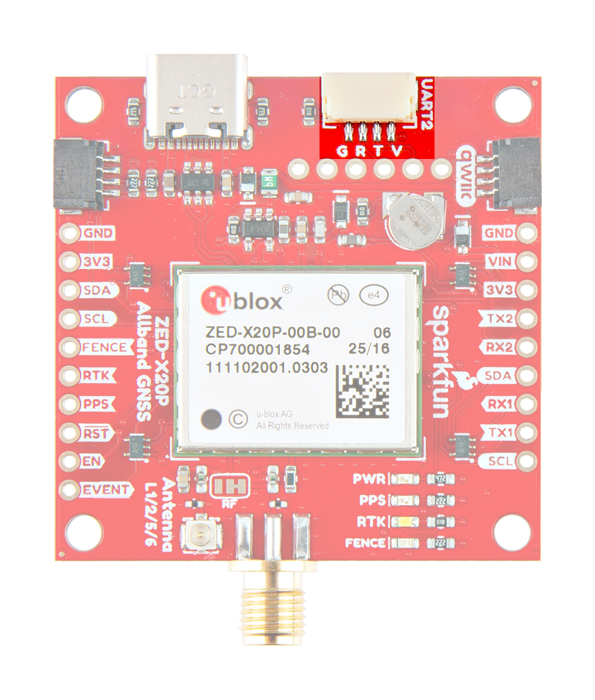{ width="400" }](./assets/img/hookup_guide/jst.png "Click to enlarge")
<figcaption markdown>The JST connector on the ZED-X20P GNSS breakout board.</figcaption>
</figure>

!!! info "Supported Protocols"
	The UART interface supports the following protocols:

	- Input messages: NMEA and UBX
	- Output messages: NMEA (GGA, GLL, GSA, GSV, RMC, VTG, and TXT)

!!! info "Configuration Settings"
	The UART interface can be configured with the `CFG-UART2-*` messages, but will initially have the following settings:

	- Baudrate: 9600 to 921600bps *(Default: 38400bps)*
	- Data Bits: 8
	- Parity: No
	- Stop Bits: 1
	- Flow Control: None

!!! warning "Bus Contention"
	To avoid [bus contention](https://en.wikipedia.org/wiki/Bus_contention) issues between the BlueSMiRF header pins or the JST connector; make sure only one devices is connected to either of these connection options.

!!! tip "Pin Connections"
	When connecting the ZED-X20P GNSS breakout board to another device, users need to be aware of the pin connections and voltage ranges of the products. Below, is a table of the pin connections for the JST connector on the ZED-X20P GNSS breakout board.

	<article style="text-align: center;" markdown>

	<table border="1" markdown>
	<tr markdown>
	<th style="vertical-align:middle;">Pin Number</th>
	<td align="center" markdown>
		**1** 
		*(Left Side)*
	</td>
	<td align="center" markdown>**2**</td>
	<td align="center" markdown>**3**</td>
	<td align="center" markdown>
		**4** 
		*(Right)*
	</td>
	</tr>
	<tr markdown>
	<th style="vertical-align:middle;">Label</th>
	<td align="center" markdown>`3V3`</td>
	<td align="center" markdown>`TXD`</td>
	<td align="center" markdown>`RXD`</td>
	<td align="center" markdown>`GND`</td>
	</tr>
	<tr markdown>
	<th style="vertical-align:middle;">Function</th>
	<td align="center" markdown>Output Voltage: **3.3V**</td>
	<td align="center" markdown>UART - Transmit</td>
	<td align="center" markdown>UART - Receive</td>
	<td align="center" markdown>Ground</td>
	</tr>
	</table>

	</article>

## External Antenna
The ZED-X20P GNSS breakout board has two options for connecting an external GNSS antenna; the U.FL and SMA connectors. By default, the SMA connector is the primary interface. In order to utilize the U.FL connector, the `RF` jumper must be modified to redirect the signal path from the SMA connector. Then, an external antenna can be connected to the U.FL connector on the board with an U.FL to SMA adapter cable.

<figure markdown>
[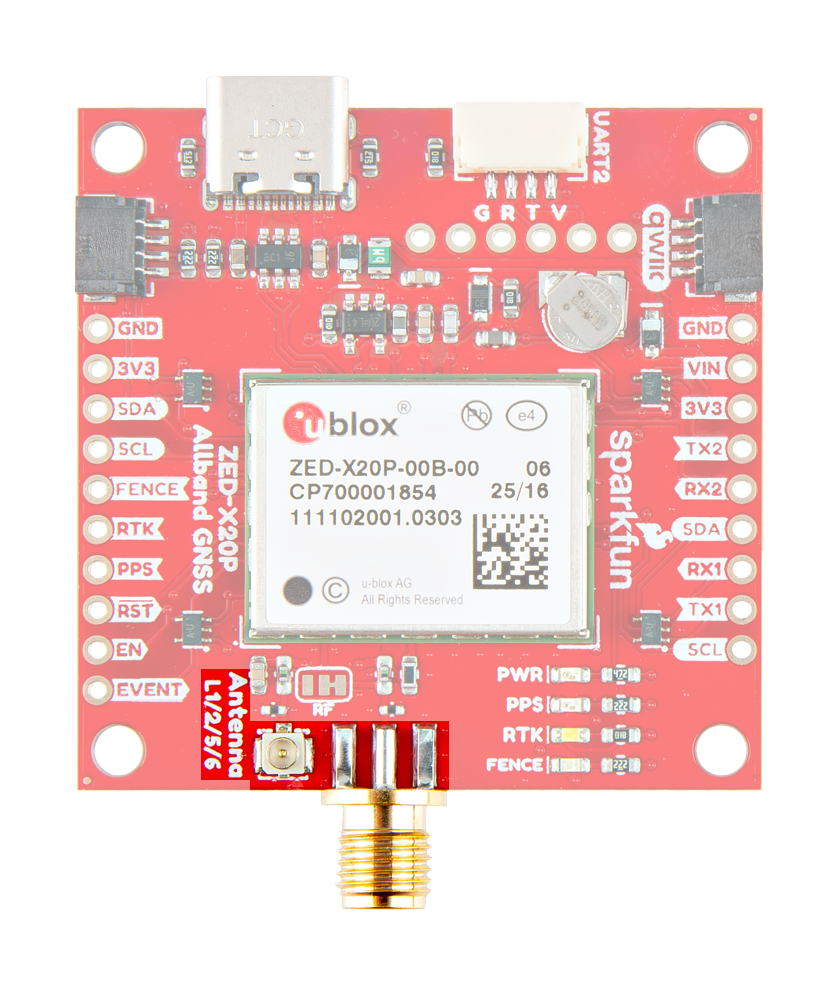{ width="400" }](./assets/img/hookup_guide/antenna.png "Click to enlarge")
<figcaption markdown>The RF connections to attach an external GNSS antenna to the ZED-X20P GNSS breakout board.</figcaption>
</figure>

<figure markdown>
[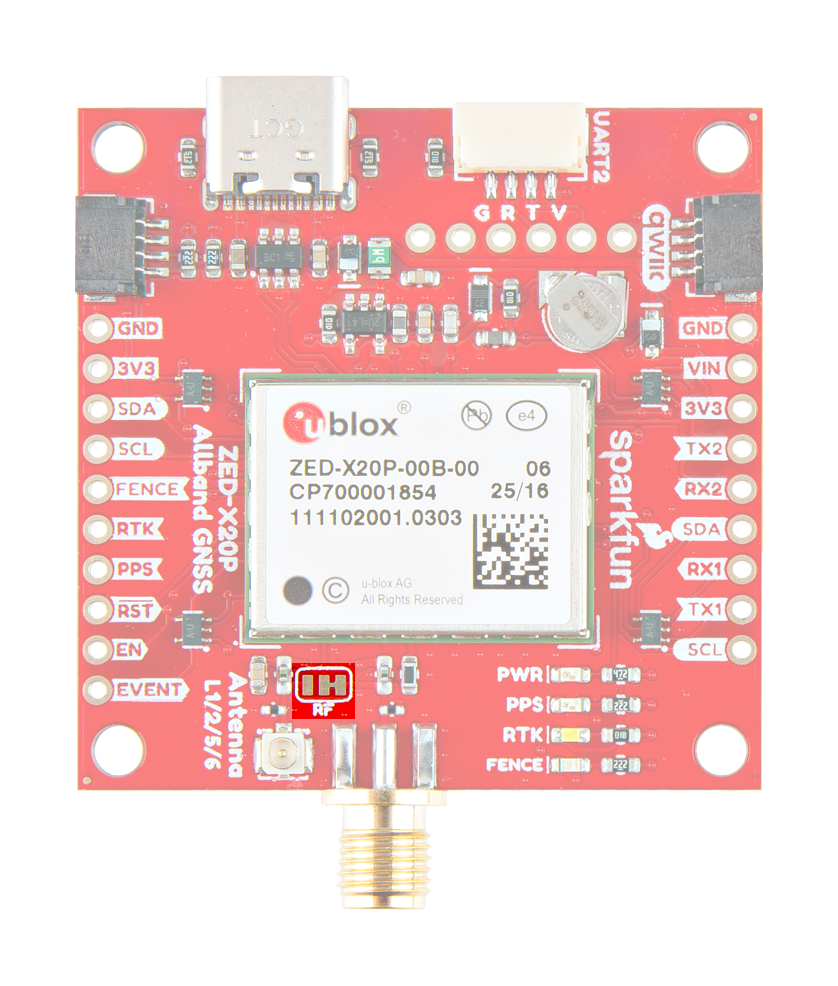{ width="400" }](./assets/img/hookup_guide/jumpers-RF.png "Click to enlarge")
<figcaption markdown>The `RF` jumper that needs to be modified to utilize the U.FL connector.</figcaption>
</figure>

!!! tip
	For the best performance, we recommend users choose a compatible L1/L5 GNSS antenna and utilize a low-loss cable. Also, don't forget that GNSS signals are fairly weak and can't penetrate buildings or dense vegetation. The GNSS antenna should have an unobstructed view of the sky.

## Status LEDs

<figure markdown>
[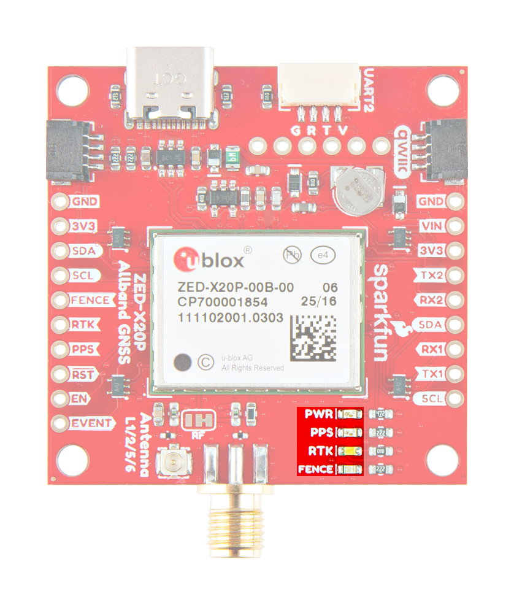{ width="400" }](./assets/img/hookup_guide/LEDs.png "Click to enlarge")
<figcaption markdown>The status indicator LEDs on the ZED-X20P GNSS breakout board.</figcaption>
</figure>

There are two status LEDs on the ZED-X20P GNSS breakout board:

- `PWR` - Power *(Red)*
	- Turns on once 3.3V power is supplied to the board
- `PPS` - Pulse-Per-Second *(Yellow)*
	- Indicates when there is a time pulse signal *(see the **[PPS Output](#pps-output)** section)*
- `RTK` - RTK correction indicator *(White)*

	??? info "LED Status"
		- **On** - Indicates that no carrier phase solution is available
		- *Blinking* - Indicates that a valid stream of correction messages is being received and utilized, but no RTK fixed mode has been achieved
		- **Off** - Indicates that RTK fixed mode has been achieved

- `FENCE` - Geofence status indicator *(Blue)*

	??? info "LED Status"
		- **On** - The `GEOFENCE_STAT` pin is always set to high level when the combined geofence state is unknown
		- **Off** - A low level can represent either an inside or outside state based upon the `CFG-GEOFENCE-PINPOL` configuration

!!! info
	For low power applications, the LEDs can be disabled to conserve energy. *See the [**Jumpers** section](#jumpers).*

## Jumpers

??? note "Never modified a jumper before?"
	Check out our <a href="https://learn.sparkfun.com/tutorials/664">Jumper Pads and PCB Traces tutorial</a> for a quick introduction!

	

	-   <a href="https://learn.sparkfun.com/tutorials/664">
		<figure markdown>
		
		</figure>

		---

		**How to Work with Jumper Pads and PCB Traces**</a>

	

There are eight jumpers on the back of the board that can be used to easily modify the hardware connections on the board.

<figure markdown>
[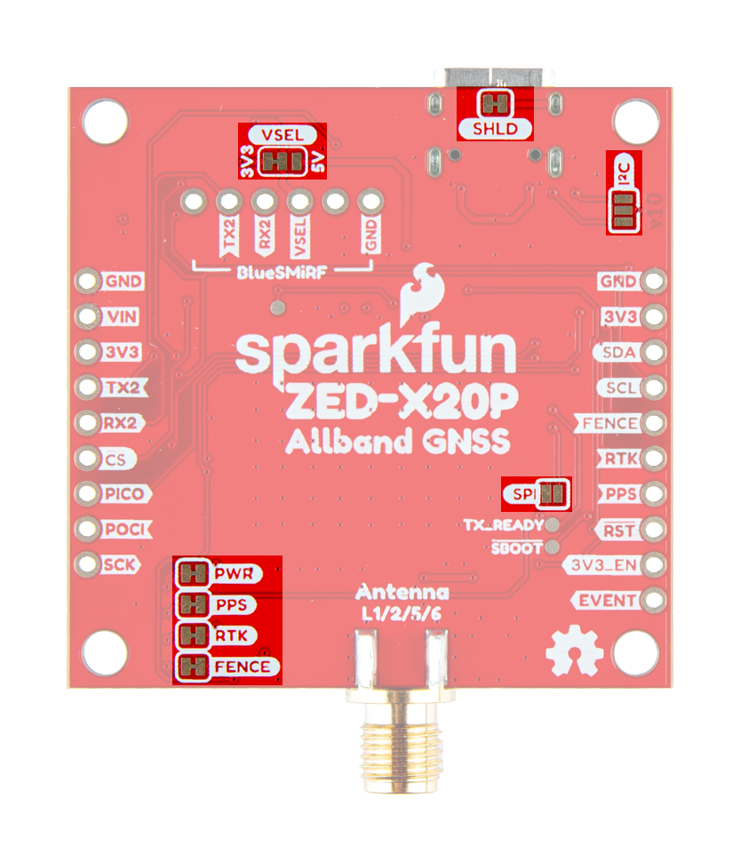{ width="400" }](./assets/img/hookup_guide/jumpers.png "Click to enlarge")
<figcaption markdown>
The jumpers on the bottom of the ZED-X20P GNSS breakout board.
</figcaption>
</figure>

LED Jumpers
:   Four of the jumpers control power to the status LEDs on the board.

	!!! info
		By default, all the jumpers are connected, to power the status LEDs. For low power applications, users can cut the jumpers to disconnect power from each of the LEDs.

	- **`PWR`** - This jumper can be cut to remove power from the red, power LED.
	- **`PPS`** - This jumper can be cut to remove power from the yellow, `PPS` LED that is provided by the [`PPS` signal](#pps-output).
	- **`RTK`** - This jumper can be cut to remove power from the white, RTK correction LED.
	- **`FENCE`** - This jumper can be cut to remove power from the blue, Geofence status LED.

**<code>I^2^C</code>**
:   This jumper can be be modified to connect pull-up resistors to the `SCL` and `SDA` connections of the I^2^C interface.

**`SPI`**
:   This jumper is connected to the `D_SEL` pin and can be modified to enable the SPI interface on the `RX`, `TX`, `SDA`, and `SCL` pins.

**`VSEL`**
:   This jumper can be modified to configure/disconnect the `VCC` pin of the 4-pin locking JST connector to/from `3V3` or `5V` power.

**`SHLD`**
:   This jumper can be cut to disconnect the shield of the USB-C connector from the board's ground plane.
