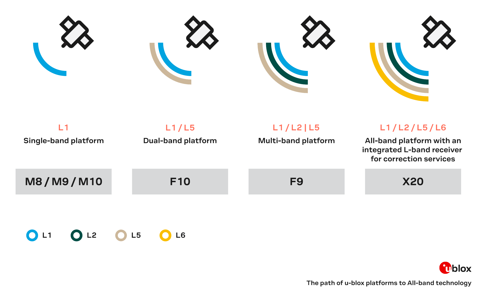

<figure markdown>

</figure>

---

# Introduction

-   <a href="https://www.sparkfun.com/sparkfun-allband-gnss-rtk-breakout-zed-x20p-qwiic.html">
	**Allband GNSS RTK Breakout - ZED-X20P (Qwiic)** 
	**SKU:** GPS-28871

	---

	<figure markdown>
	
	</figure></a>

	<article style="text-align: center;" markdown>
	{ .tinyqr }[Purchase from SparkFun :fontawesome-solid-cart-plus:{ .heart }](https://www.sparkfun.com/sparkfun-allband-gnss-rtk-breakout-zed-x20p-qwiic.html){ .md-button .md-button--primary }
	</article>

-   The SparkFun All-band GNSS RTK Breakout - ZED-X20P (Qwiic) features the latest GNSS engine from u-blox; the X20, which is a successor to their popular F9 engine. This board's dimensions, pin layout, and connectors are very similar to the [SparkFun GPS-RTK-SMA Breakout - ZED-F9P (Qwiic)](https://www.sparkfun.com/sparkfun-gps-rtk-sma-breakout-zed-f9p-qwiic.html); and in most circumstances, can be used as a drop-in replacement. The board also accommodates users with a diverse choice of interfaces including USB, UART, SPI, and I^2^C.

	The ZED-X20P module is an all-band, high precision GNSS receiver that concurrently processes signals from the GPS, Galileo, BeiDou, QZSS, and NavIC constellations across all GNSS frequency bands, including L-band. With positioning algorithms for Real-time Kinematics (RTK), PPP-RTK, and Precise Point Positioning* (PPP) technologies, the module supports standard RTCM corrections for Virtual Reference Stations (VRS) in a Network RTK setup or a local base station setup. Additionally, L-band correction services are natively supported without the need to integrate an external receiver, such as the NEO-D9S.

	With its very high update rate, the ZED-X20P module is ideal for control applications, ensuring smooth and reliable operation. The module also protects system integrity with multi-layered defenses, including a Root of Trust, jamming and spoofing detection, cryptographic authentication of navigation messages through Galileo OSNMA, and more. This represents the highest level of integration in a single-chip receiver for the navigation and robotics markets; in unmanned autonomous vehicles (UAVs), guidance systems, and auto-steering applications.

	The ZED-X20P module is supported by the u-blox u-center 2 GNSS software for real-time performance analysis, receiver configuration, and data logging. The AssistNow Online, Offline, and Autonomous A-GNSS services can also be used with the module for faster satellite acquisition. Users can also interface with the GNSS module using NMEA 4.11 and UBX binary protocols.

	!!! note
		The USB interface does not fully comply with industry standards and is not suitable for production use. The USB 2.0 FS (full speed, 12 Mbit/s) interface can be used for host communication. Due to the hardware implementation, it may not be possible to certify the USB interface.

		`*`: Feature in development

??? question "Product Comparison"
	Below is a simple comparison table between our breakout board and Septentrio's development and evaluation kits:

	

	

	<figure markdown>
	[{ width="400" }](https://content.u-blox.com/sites/default/files/2025-03/comparison-u-blox-zed-f9p-and-zed-x20p.png "Click to enlarge")
	<figcaption markdown>A comparison chart between the ZED-X20P and ZED-F9P GNSS modules.</figcaption>
	</figure>

	

	

	<figure markdown>
	[{ width="400" }](https://content.u-blox.com/sites/default/files/2024-09/X20-u-blox-the-path-of-u-blox-platforms-to-all-band-technologyx20-u-blox-the-path-of-u-blox-platforms-to-all-band-technology-visual.png "Click to enlarge")
	<figcaption markdown>A comparison of the frequency bands supported by the various u-blox engines.</figcaption>
	</figure>

	

In this guide we'll cover how to setup the ZED-X20P GNSS breakout board. To follow along with this tutorial, at a minimum, users will need the following items:

- Computer with an operating system (OS) that is compatible with all the software installation requirements
- [USB 3.1 Cable A to C - 3 Foot](https://www.sparkfun.com/usb-3-1-cable-a-to-c-3-foot.html) - Used to interface with the ZED-X20P GNSS Breakout (1)
- [SparkFun Allband GNSS RTK Breakout - ZED-X20P (Qwiic)](https://www.sparkfun.com/sparkfun-allband-gnss-rtk-breakout-zed-x20p-qwiic.html)

1. If your computer doesn't have a USB-A slot, then choose an appropriate cable or adapter.

-   <a href="https://www.sparkfun.com/usb-3-1-cable-a-to-c-3-foot.html">
	<figure markdown>
	
	</figure>

	---

	**USB 3.1 Cable A to C - 3 Foot** 
	CAB-14743</a>

-   <a href="https://www.sparkfun.com/sparkfun-allband-gnss-rtk-breakout-zed-x20p-qwiic.html">
	<figure markdown>
	
	</figure>

	---

	**Allband GNSS RTK Breakout - ZED-X20P (Qwiic)** 
	GPS-28871</a>

## Section Topics
This guide is divided into three sections:

- The **Quickstart Guide** assumes a working knowledge of GNSS receiver, development boards, and the required software to program and/or configure them for your project's needs. It only covers basic hardware information and assembly instructions users would need to get started with this product.
- The **Hardware** section has two sub-sections that provide:
	- An overview of the board's design, major components, and interfaces. Refer to this page for information on the connectors, breakout pins, and jumpers.
	- Assembly instructions for this product's interfaces.
- The **Software** section has several sub-sections. The ZED-X20P module has numerous capabilities and a multitude of ways to configure and interface with them.
- In the **Resources** and **Support** sections, users can find the design files (KiCad files & schematic), relevant documentation (datasheets, white papers, etc.) and other helpful links on the Resources page. Lastly, the **Troubleshooting Tips** page includes helpful tips and instructions for how to receive technical support from SparkFun.
