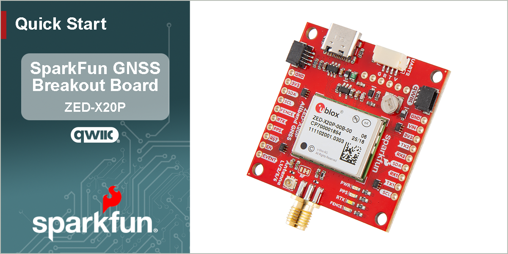

<figure markdown>

</figure>

---

# Quick Start

<!-- Overview -->
--8<-- "./introduction.md:74:111"

<!-- Board Layout -->
--8<-- "hardware_overview.md:75:112"

<!-- Assembly -->
--8<-- "hardware_assembly.md::23"

<!-- u-center 2 -->
--8<-- "software_overview.md::2"
--8<-- "software_overview.md:43:74"

## Getting Started
Users should [reference the user manual](https://www.u-blox.com/en/info/u-center-2-user-guide#31-installing-u-center-2) for more information on the u-center 2 software.

<iframe src="https://www.youtube.com/embed/sA5bCcolwag" title="Getting started with u-center 2 (ver. 22.10.)" frameborder="0" allow="accelerometer; autoplay; clipboard-write; encrypted-media; gyroscope; picture-in-picture" allowfullscreen></iframe>
{ .qr width="85" }

