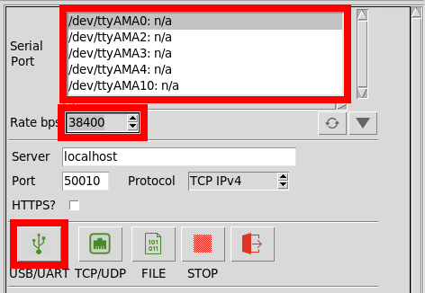
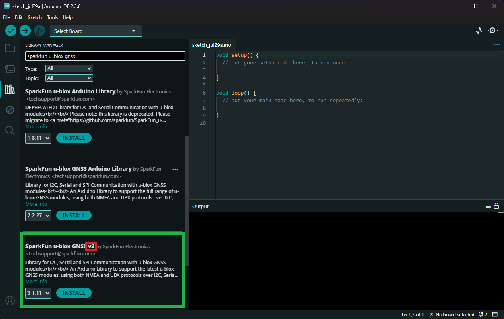

## u-center 2 Software
[u-center 2](https://www.u-blox.com/en/product/u-center) is u-blox's software application for configuration, evaluation, and debugging of u-blox GNSS receivers and services. The software provides a relatively, simple graphics user interface to assess and test u-blox GNSS modules for navigation and positioning performance. It also allows users to define or apply GNSS product configurations for specific use cases. Saving, restoring, or sharing configurations between different products is easy.


<div class="grid cards" markdown>

<div markdown>

<article class="video-500px" style="text-align: center; margin: auto;" markdown>
<iframe src="https://www.youtube.com/embed/SCdULSkTcDM" title="u-blox u-center 2" frameborder="0" allow="accelerometer; autoplay; clipboard-write; encrypted-media; gyroscope; picture-in-picture" allowfullscreen></iframe>
{ .qr width="85" }
</article>

</div>


<div markdown>

- [Tutorials](https://www.u-blox.com/en/u-center2-tutorials)
- [User Manual](https://www.u-blox.com/en/info/u-center-2-user-guide)
	- [Connecting to a Device](https://www.u-blox.com/en/info/u-center-2-user-guide#32-connecting-a-device)
	- [Device Configuration](https://www.u-blox.com/en/info/u-center-2-user-guide#5-device-configuration)
	- [Views](https://www.u-blox.com/en/info/u-center-2-user-guide#8-views)
		- [Basic Data](https://www.u-blox.com/en/info/u-center-2-user-guide#84-data-view)
		- [Map](https://www.u-blox.com/en/info/u-center-2-user-guide#85-map-view)
		- [Satellites](https://www.u-blox.com/en/info/u-center-2-user-guide#87-satellite-signal-view)
		- [Deviation Plot](https://www.u-blox.com/en/info/u-center-2-user-guide#810-deviation-map-view)

</div>

</div>


!!! warning "Firmware Updates"
	Firmware updates can only be performed with the `UART1` interface of the ZED-X20P


!!! info "Product Compatibility"
	Gen 10 and later u-blox GNSS modules


### Installation
Installation of the [u-center 2 software](https://www.u-blox.com/en/product/u-center) is straight forward; simply, click on the button below to download the software. User should be aware that the first time the software accessed, they will need to either create or login to their existing u-blox account. If necessary, users can follow the video below or [reference the user manual](https://www.u-blox.com/en/info/u-center-2-user-guide#31-installing-u-center-2) for more instructions.


<div class="grid cards" markdown>

<div markdown>

<article class="video-500px" style="text-align: center; margin: auto;"  markdown>
<iframe src="https://www.youtube.com/embed/UY2XTb72SXA" title="How to download, install &amp; run u-center 2 (ver. 22.10.)" frameborder="0" allow="accelerometer; autoplay; clipboard-write; encrypted-media; gyroscope; picture-in-picture" allowfullscreen></iframe>
{ .qr width="85" }
</article>

</div>


<div markdown>

<article style="text-align: center;" markdown>
[:octicons-download-16:{ .heart } Download the u-center 2 from u-blox](https://u-center2-updates.u-blox.com/u-center2-installer.exe){ .md-button .md-button--primary target="blank" }
</article>


???+ info "System Requirements"
	**Operating Systems**

	- Windows 10 or 11


!!! note "User Account Required"
	The first time that users access the software, they will need to either create or login to their existing u-blox account. This requires internet access to login through a web browser. Once the account has been verified, users will no longer need to login again; unless they log out from the u-center 2 software.


</div>

</div>


### Video Tutorials
Users should [reference the user manual](https://www.u-blox.com/en/info/u-center-2-user-guide#31-installing-u-center-2) for more information on the u-center 2 software. However, we have also linked their [webinar](https://www.u-blox.com/en/webinars/u-center2) and some videos from their [Youtube playlist](https://www.youtube.com/playlist?list=PLSzSoRUA4EXuo9NTsbTnK84MiKvbVCEKt) on u-blox's u-center 2 software application.


<div class="grid cards" align="center" markdown>

<article class="video-container" style="text-align: center;" markdown>
<iframe src="https://www.youtube.com/embed/ZYttFyZ_7Uo" title="Explore the possibilities of u-blox positioning device configuration with u-center 2" frameborder="0" allow="accelerometer; autoplay; clipboard-write; encrypted-media; gyroscope; picture-in-picture" allowfullscreen></iframe>
{ .qr width="85" }
</article>


<article class="video-container" style="text-align: center;" markdown>
<iframe src="https://www.youtube.com/embed/sA5bCcolwag" title="Getting started with u-center 2 (ver. 22.10.)" frameborder="0" allow="accelerometer; autoplay; clipboard-write; encrypted-media; gyroscope; picture-in-picture" allowfullscreen></iframe>
{ .qr width="85" }
</article>


<article class="video-container" style="text-align: center;" markdown>
<iframe src="https://www.youtube.com/embed/RonjsBTdW3A" title="Firmware update on u-center 2 (ver. 23.03.)" frameborder="0" allow="accelerometer; autoplay; clipboard-write; encrypted-media; gyroscope; picture-in-picture" allowfullscreen></iframe>
{ .qr width="85" }
</article>

</div>


## PyGPSClient
As an alternative to u-center 2, we recommend [PyGPSClient](https://github.com/semuconsulting/PyGPSClient) for users with computers that run on MacOS or Linux.


???+ info "Resources"
	For additional information, users can refer to the following resources for the PyGPSClient software:

	- :material-github: [GitHub Repository](https://github.com/semuconsulting/PyGPSClient)
	- [Installation Instructions](https://github.com/semuconsulting/PyGPSClient?tab=readme-ov-file#installation)
	- [PyPI Project](https://pypi.org/project/pygpsclient/)


### Installation
There are a variety of [installation methods](https://github.com/semuconsulting/PyGPSClient?tab=readme-ov-file#installation) detailed in the GitHub repository's `README.md` file. However, we recommend utilizing the `pip` installation method.


!!! terminal "Installation Commands"
	Depending on how Python is installed on the computer, one of the following commands should allow users to install the software.

	- 
		``` bash
		python3 -m pip install pygpsclient
		```
	- 
		``` bash
		pip install pygpsclient
		```


	???+ info "System Requirements"
		This installation method requires an internet connection. Additionally, users will also need administrative privileges *(or root access `sudo`)* for the installation.


### Connecting to the ZED-X20P
Before users can connect to the ZED-X20P GNSS Flex module, they will need to specify the settings of the UART port in PyGPSClient. Once configured, users can select the <kbd>:material-usb:</kbd> button and PyGPSClient will automatically attempt to connect to the GNSS module.

- Below, is a list of the default settings for `UART` ports of the ZED-X20P. These settings should be selected in the configuration menu.
- For the `Serial Port`, select the port associated with the attached UART interface.


<div class="grid" markdown>

<div markdown>

<figure markdown>
[{ width="400" }](./assets/img/hookup_guide/pygpsclient-uart_settings-small.png "Click to enlarge")
<figcaption markdown>
Specify the settings for the UART port in PyGPSClient.
</figcaption>
</figure>

</div>


<div markdown>

???+ tip "Default Settings"
	The UART ports of the ZED-X20P GNSS module will have the following default configuration:

	- Baudrate: 38400bps
	- Data Bits: 8
	- Parity: No
	- Stop Bits: 1
	- Flow Control: None

</div>

</div>


## Arduino IDE
!!! tip
	For first-time users, who have never programmed before and are looking to use the Arduino IDE, we recommend beginning with the <a href="https://www.sparkfun.com/products/15631">SparkFun Inventor's Kit (SIK)</a>, which is designed to help users get started programming with the Arduino IDE.

Most users may already be familiar with the Arduino IDE and its use. However, for those of you who have never heard the name *Arduino* before, feel free to check out the [Arduino website](https://www.arduino.cc/en/Guide/HomePage). To get started with using the Arduino IDE, check out our tutorials below:


<div class="grid cards" markdown align="center">

-  <a href="https://learn.sparkfun.com/tutorials/50"><figure markdown>
	
	</figure>

	---

	**What is an Arduino?**</a>

-  <a href="https://learn.sparkfun.com/tutorials/61"><figure markdown>
	
	</figure>

	---

	**Installing the Arduino IDE**</a>

-  <a href="https://learn.sparkfun.com/tutorials/15"><figure markdown>
	
	</figure>

	---

	**Installing an Arduino Library**</a>

-  <a href="https://learn.sparkfun.com/tutorials/1265"><figure markdown>
	
	</figure>

	---

	**Installing Board Definitions in the Arduino IDE**</a>
</div>


### SparkFun u-blox GNSS v3 Library
The [SparkFun u-blox GNSS v3](https://github.com/sparkfun/SparkFun_u-blox_GNSS_v3) library can be installed from the library manager in the Arduino IDE by searching for:

	SparkFun u-blox GNSS v3

<div class="grid" markdown>

<div markdown>

<figure markdown>
[{ width="400" }](./assets/img/hookup_guide/arduino_library.png)
<figcaption markdown>SparkFun u-blox GNSS v3 library in the library manager of the Arduino IDE.</figcaption>
</figure>

</div>


<div markdown>

!!! tip "Manually Download the Arduino Library"
	For users who would like to manually download and install the library, the `*.zip` file can be accessed from the [GitHub repository](https://github.com/sparkfun/SparkFun_u-blox_GNSS_v3) or downloaded by clicking the button below.

	<article style="text-align: center;" markdown>
	[:octicons-download-16:{ .heart } Download the Arduino Library](https://github.com/sparkfun/SparkFun_u-blox_GNSS_v3/archive/refs/heads/main.zip){ .md-button .md-button--primary }
	</article>

</div>

</div>
