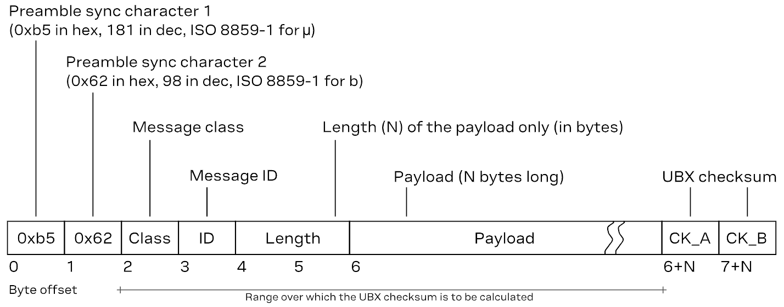

## UBX Protocol
u-blox receivers support a u-blox-proprietary protocol (UBX) to communicate with a host computer. This protocol has the following key features:

- Compact - uses 8-bit binary data
- Checksum protected - uses a low-overhead checksum algorithm
- Modular - uses a two-stage message identifier (Class and Message ID)

### Message Structure
The structure of a basic UBX frame is shown in the following diagram.

<figure markdown>
[{ width="750" }](./assets/img/hookup_guide/ubx_message_framework.png "Click to enlarge")
<figcaption markdown>The structure of a basic UBX message.</figcaption>
</figure>

- Every frame starts with a 2-byte preamble consisting of two synchronization characters: `0xb5` and `0x62`.
- A 1-byte message class field follows. A class is a group of messages that are related to each other.
- A 1-byte message ID field defines the message that is to follow.
- A 2-byte length field follows. The length is defined as being that of the payload only. It does not include the preamble, message class, message ID, length, or UBX checksum fields. The number format of the length field is an unsigned little-endian 16-bit integer (a "U2" in UBX data types).
- The payload field contains a variable number (= length) of bytes.
- The two 1-byte `CK_A` and `CK_B` fields hold a 16-bit checksum whose calculation is defined in UBX checksum section. This concludes the frame.

### Acknowledgement
When messages from the class `CFG` are sent to the receiver, the receiver will send an *acknowledge* (`UBX-ACK-ACK`) or a *not acknowledge* (`UBX-ACK-NAK`) message back to the sender, depending on whether or not the message was processed correctly.

## Common UBX Messages

**`UBX-ACK`** - Acknowledgement and negative acknowledgement messages

| Message | Class/ID | Description (Type) |
| :------ | :------: | :----------------- |
| `UBX-ACK-ACK` | `0x05 0x01` | - Message acknowledged (Output) |
| `UBX-ACK-NAK` | `0x05 0x00` | - Message not acknowledged (Output) |

**`UBX-CFG`** - Configuration and command messages

| Message | Class/ID | Description (Type) |
| :------ | :------: | :----------------- |
| `UBX-CFG-CFG`    | `0x06 0x09` | - Clear, save and load configurations (Command) |
| `UBX-CFG-RST`    | `0x06 0x04` | - Reset receiver / Clear backup data structures (Command) |
| `UBX-CFG-VALDEL` | `0x06 0x8c` | - Delete configuration item values (Set) - Delete configuration item values (with transaction) (Set) |
| `UBX-CFG-VALGET` | `0x06 0x8b` | - Get configuration items (Poll request) - Configuration items (Polled) |
| `UBX-CFG-VALSET` | `0x06 0x8a` | - Set configuration item values (Set) - Set configuration item values (with transaction) (Set) |

**`UBX-MON`** - Monitoring messages

| Message | Class/ID | Description (Type) |
| :------ | :------: | :----------------- |
| `UBX-MON-SYS` | `0x0A 0x39` | Current system performance information for monitoring purposes |
| `UBX-MON-VER` | `0x0a 0x04` | - Poll receiver and software version (Poll request) - Receiver and software version (Polled) |

**`UBX-NAV`** - Navigation solution messages

| Message | Class/ID | Description (Type) |
| :------ | :------: | :----------------- |
| `UBX-NAV-POSLLH` | `0x01 0x02` | - Geodetic position solution (Periodic/polled) |
| `UBX-NAV-PVT`    | `0x01 0x07` | - Navigation position velocity time solution (Periodic/polled) |

**`UBX-UPD`** - Firmware update messages

| Message | Class/ID | Description (Type) |
| :------ | :------: | :----------------- |
| `UBX-UPD-SOS` | `0x09 0x14` | - Poll backup restore status (Poll request) - Create backup in flash (Command) - Clear backup in flash (Command) - Backup creation acknowledge (Output) - System restored from backup (Output)|
